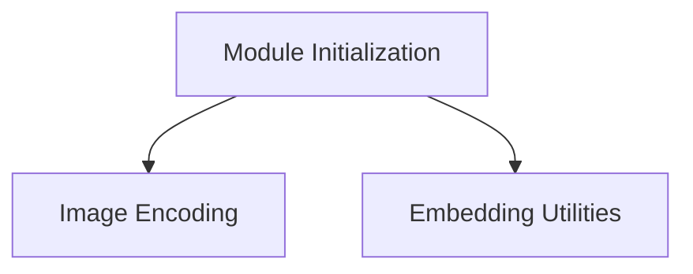

# CLIP Core API Module Documentation

## Introduction

The `clip_core_api` module provides the core functionalities for interacting with the CLIP (Contrastive Language-Image Pre-training) model within the `llama.cpp` ecosystem. It encompasses features for model initialization, image encoding, and utility functions related to embeddings. This module is essential for applications requiring multimodal capabilities, specifically integrating image understanding with language models.

## Architecture Overview

The `clip_core_api` module is structured into several key sub-modules, each handling a specific aspect of the CLIP model's operation. The relationships between these sub-modules are illustrated in the diagram below:

<!-- DIAGRAM_JSON
{
    "direction": "TD",
    "nodes": [
        {"id": "initialization", "label": "Module Initialization", "type": "module", "link": "initialization.md"},
        {"id": "image_encoding", "label": "Image Encoding", "type": "module", "link": "image_encoding.md"},
        {"id": "embedding_utilities", "label": "Embedding Utilities", "type": "module", "link": "embedding_utilities.md"}
    ],
    "edges": [
        {"source": "initialization", "target": "image_encoding"},
        {"source": "initialization", "target": "embedding_utilities"}
    ],
    "groups": []
}
-->

## Sub-modules

### [Module Initialization](initialization.md)
This sub-module is responsible for loading and initializing the CLIP model contexts for both vision and audio modalities. It handles the initial setup required before any encoding or processing can occur.

### [Image Encoding](image_encoding.md)
This sub-module provides the primary functions for processing raw image data (float images) and converting them into CLIP embeddings. It also includes debug functionalities for development and testing purposes.

### [Embedding Utilities](embedding_utilities.md)
This sub-module contains utility functions that assist in managing and querying embedding-related information, such as determining the byte size of generated embeddings.