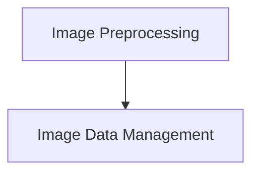

# CLIP Image Basic Operations Module

This module (`clip_image_basic_ops`) provides fundamental functionalities for image manipulation and preprocessing specifically tailored for CLIP (Contrastive Language-Image Pre-training) models. It encompasses operations such as image construction from pixel data, type conversion, and various preprocessing techniques required before feeding images into a CLIP model.

## Architecture Overview

The `clip_image_basic_ops` module is structured into two main sub-modules:

- **Image Preprocessing**: Handles complex image transformations like resizing, padding, and slicing based on different projector types.
- **Image Data Management**: Manages the creation of image objects from raw pixel data and conversion between floating-point and 8-bit integer representations.

<!-- DIAGRAM_JSON
{
    "direction": "TD",
    "nodes": [
        {"id": "image_preprocessing", "label": "Image Preprocessing", "type": "module", "link": "image_preprocessing.md"},
        {"id": "image_data_management", "label": "Image Data Management", "type": "module", "link": "image_data_management.md"}
    ],
    "edges": [
        {"source": "image_preprocessing", "target": "image_data_management"}
    ],
    "groups": []
}
-->

## Sub-modules

### [Image Preprocessing](image_preprocessing.md)
This sub-module is responsible for preparing raw image data for various CLIP projector types. It includes functions for resizing images while preserving aspect ratios, padding images to specific dimensions, slicing images into multiple parts (e.g., for ultra-high-definition inputs), and normalizing pixel values.

### [Image Data Management](image_data_management.md)
This sub-module offers utilities for handling the fundamental representation of image data. It provides functions to construct image objects directly from raw RGB pixel arrays and to convert image data between different precision formats (e.g., from floating-point to 8-bit unsigned integers for display or storage).
