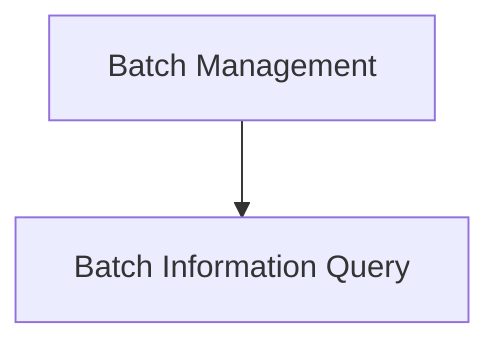

# clip_image_batch_utils Module Documentation

## Introduction and Purpose

The `clip_image_batch_utils` module provides utility functions for managing batches of image and audio (mel spectrogram) data within the CLIP processing pipeline. It enables adding new entries to a batch and querying fundamental properties like the number of items and their dimensions. This module is crucial for efficiently handling multi-modal inputs for the CLIP model.

## Architecture Overview

The `clip_image_batch_utils` module is structured into two main sub-modules:

1.  **Batch Management**: Handles the addition of new data entries to the batch.
2.  **Batch Information Query**: Provides methods to retrieve metadata about the batch and its individual entries.

<!-- DIAGRAM_JSON
{
    "direction": "TD",
    "nodes": [
        {"id": "batch_management", "label": "Batch Management", "type": "module", "link": "batch_management.md"},
        {"id": "batch_query", "label": "Batch Information Query", "type": "module", "link": "batch_query.md"}
    ],
    "edges": [
        {"source": "batch_management", "target": "batch_query"}
    ],
    "groups": []
}
-->

## High-Level Functionality

### Batch Management ([batch_management.md](batch_management.md))
This sub-module is responsible for adding new data, specifically mel spectrograms (audio representation), to a `clip_image_f32_batch` structure. It allocates memory and copies the provided audio data into a new `clip_image_f32` object, which is then added to the batch.

### Batch Information Query ([batch_query.md](batch_query.md))
This sub-module provides functionalities to inspect the contents of a `clip_image_f32_batch`. It allows querying the total number of entries in the batch and retrieving the width (nx) and height (ny) dimensions for a specific entry by its index. This is essential for understanding the structure and size of the batched data.
