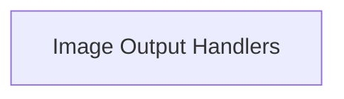

# `clip_image_output` Module Documentation

## Introduction and Purpose
The `clip_image_output` module is responsible for handling the output and saving of image data generated or processed within the CLIP image processing pipeline. It provides functionalities to persist image buffers into standard image file formats, ensuring that visual outputs can be reviewed or utilized by other systems.

## Architecture Overview
The `clip_image_output` module primarily interacts with raw image data (e.g., `clip_image_u8`) and external file systems to write images. It contains handlers for different image formats, encapsulating the specifics of each format's header and pixel data arrangement.

<!-- DIAGRAM_JSON
{
    "direction": "TD",
    "nodes": [
        {"id": "image_output_handlers", "label": "Image Output Handlers", "type": "module", "link": "image_output_handlers.md"}
    ],
    "edges": [],
    "groups": []
}
-->

## Sub-modules

### `image_output_handlers`
This sub-module provides core utilities for saving image data to various file formats. It includes functions for writing images to formats like PPM and BMP, handling the specific file structures and pixel arrangements required by each format. Refer to [image_output_handlers.md](image_output_handlers.md) for detailed documentation.
