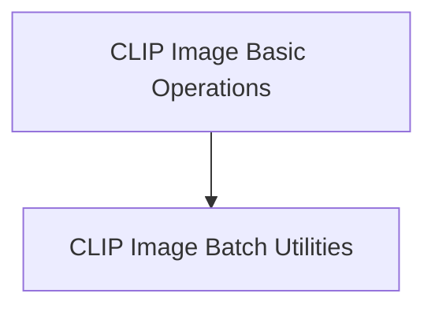

## Overview of `clip_image_processing` Module

### Purpose of the Module

The `clip_image_processing` module provides a comprehensive set of functionalities for handling and preparing image data specifically for CLIP (Contrastive Language-Image Pre-training) models. It includes utilities for basic image operations like preprocessing and data management, as well as advanced features for batch processing of images and audio (mel spectrograms). The module ensures that image inputs are correctly formatted, transformed, and batched for efficient inference and training with CLIP models.

### Architecture of the Module

The `clip_image_processing` module is composed of two primary sub-modules, each handling distinct aspects of image and multi-modal data preparation for CLIP models.

### References to Core Components Documentation

The following are the core sub-modules within `clip_image_processing`, with links to their detailed documentation:

*   **[CLIP Image Basic Operations](clip_image_basic_ops.md)**: This sub-module provides fundamental functionalities for image manipulation and preprocessing specifically tailored for CLIP models. It encompasses operations such as image construction from pixel data, type conversion, and various preprocessing techniques required before feeding images into a CLIP model.
*   **[CLIP Image Batch Utilities](clip_image_batch_utils.md)**: This sub-module offers utility functions for managing batches of image and audio (mel spectrogram) data within the CLIP processing pipeline. It enables adding new entries to a batch and querying fundamental properties like the number of items and their dimensions, crucial for efficiently handling multi-modal inputs.