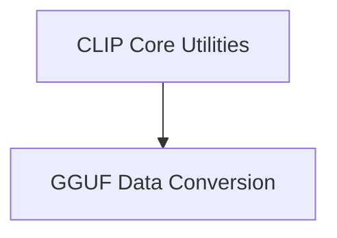

# CLIP Implementation Details

## Introduction

The `clip_implementation_details` module provides core utilities, data structures, and logging mechanisms fundamental to the CLIP (Contrastive Language-Image Pre-training) model's operation within the `llama.cpp` ecosystem. It encompasses functions for converting GGUF key-value pairs to string representations and defines essential image data types, projector type conversions, and an internal logging framework.

## Architecture Overview

This module is structured into two main sub-modules:

*   **CLIP Core Utilities**: Manages CLIP-specific data types, type conversions, and the module's logging system.
*   **GGUF Data Conversion**: Handles the conversion of GGUF (GGML Universal File Format) key-value data to string formats.

These sub-modules interact by providing foundational services that other parts of the CLIP and `llama.cpp` project can utilize. For instance, GGUF data conversion is a general utility that might be used across different components that need to interpret GGUF metadata, while CLIP Core Utilities are specifically tailored for the CLIP model's internal data handling and diagnostics.

<!-- DIAGRAM_JSON
{
    "direction": "TD",
    "nodes": [
        {"id": "clip_core_utilities", "label": "CLIP Core Utilities", "type": "module", "link": "clip_core_utilities.md"},
        {"id": "gguf_data_conversion", "label": "GGUF Data Conversion", "type": "module", "link": "gguf_data_conversion.md"}
    ],
    "edges": [
        {"source": "clip_core_utilities", "target": "gguf_data_conversion"}
    ],
    "groups": []
}
-->

## High-Level Functionality of Sub-modules

### [CLIP Core Utilities](clip_core_utilities.md)

This sub-module defines fundamental data structures such as `clip_image_u8` (for RGB uint8 images) and `clip_image_f32` (for float images or audio data). It also provides utility functions like `clip_projector_type_from_string` for converting string representations to projector types and implements a comprehensive internal logging system (`clip_log_internal`, `LOG_INF`, `LOG_WRN`, etc.) crucial for debugging and operational insights.

### [GGUF Data Conversion](gguf_data_conversion.md)

The `gguf_data_conversion` sub-module contains the `gguf_kv_to_str` function, which is responsible for robustly converting key-value pairs from a GGUF context into a human-readable string format. This includes handling various GGUF data types, notably strings and arrays, and correctly escaping special characters within string values to ensure valid output.