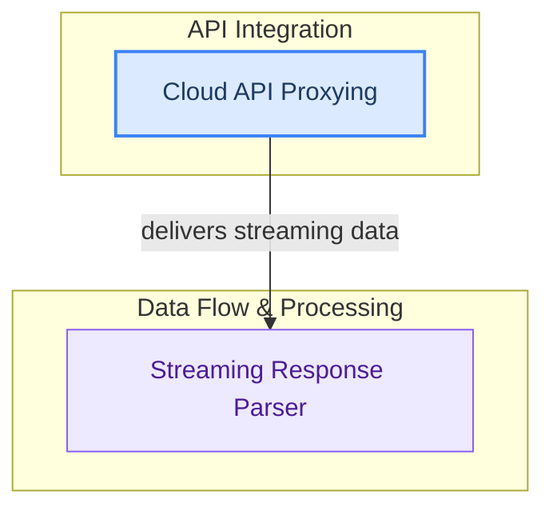

# Cloud and Streaming Features Overview

This module outlines the system's capabilities for integrating with and proxying requests to external cloud-based language models, alongside its robust handling and real-time parsing of streaming data responses.

<!-- DIAGRAM_JSON
{
    "direction": "TD",
    "nodes": [
        {"id": "cloud_api_proxy", "label": "Cloud API Proxying", "type": "module", "link": "cloud_api_proxy.md"},
        {"id": "streaming_data_parser", "label": "Streaming Response Parser", "type": "module", "link": "streaming_data_parser.md"}
    ],
    "edges": [
        {"source": "cloud_api_proxy", "target": "streaming_data_parser", "label": "delivers streaming data"}
    ],
    "groups": [
        {"id": "api_integration", "label": "API Integration", "role": "surface", "nodes": ["cloud_api_proxy"]},
        {"id": "data_flow", "label": "Data Flow & Processing", "role": "analytical", "nodes": ["streaming_data_parser"]}
    ]
}
-->
