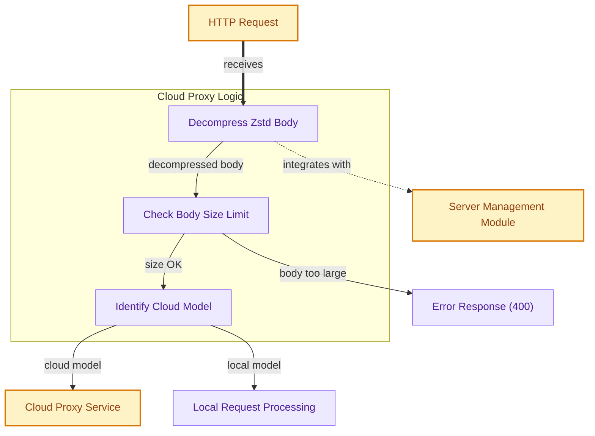

# Cloud Proxy Middleware

This middleware intercepts incoming HTTP requests, decompresses Zstd-encoded bodies, checks for size limits, identifies if the request targets a cloud model, and either proxies it to an external cloud service or passes it to local server handlers.

<!-- DIAGRAM_JSON
{
    "direction": "TD",
    "nodes": [
        {
            "id": "http_request",
            "label": "HTTP Request",
            "type": "external",
            "link": null
        },
        {
            "id": "decompress_zstd",
            "label": "Decompress Zstd Body",
            "type": "component",
            "link": null
        },
        {
            "id": "check_size",
            "label": "Check Body Size Limit",
            "type": "component",
            "link": null
        },
        {
            "id": "identify_cloud_model",
            "label": "Identify Cloud Model",
            "type": "component",
            "link": null
        },
        {
            "id": "proxy_cloud_service",
            "label": "Cloud Proxy Service",
            "type": "external",
            "link": null
        },
        {
            "id": "local_processing",
            "label": "Local Request Processing",
            "type": "component",
            "link": null
        },
        {
            "id": "error_response",
            "label": "Error Response (400)",
            "type": "component",
            "link": null
        },
        {
            "id": "server_management",
            "label": "Server Management Module",
            "type": "external",
            "link": "server_management.md"
        }
    ],
    "edges": [
        {
            "source": "http_request",
            "target": "decompress_zstd",
            "label": "receives"
        },
        {
            "source": "decompress_zstd",
            "target": "check_size",
            "label": "decompressed body"
        },
        {
            "source": "check_size",
            "target": "identify_cloud_model",
            "label": "size OK"
        },
        {
            "source": "check_size",
            "target": "error_response",
            "label": "body too large"
        },
        {
            "source": "identify_cloud_model",
            "target": "proxy_cloud_service",
            "label": "cloud model"
        },
        {
            "source": "identify_cloud_model",
            "target": "local_processing",
            "label": "local model"
        },
        {
            "source": "decompress_zstd",
            "target": "server_management",
            "label": "integrates with"
        }
    ],
    "groups": [
        {
            "id": "middleware_logic",
            "label": "Cloud Proxy Logic",
            "role": "analytical",
            "nodes": [
                "decompress_zstd",
                "check_size",
                "identify_cloud_model"
            ]
        }
    ]
}
-->
