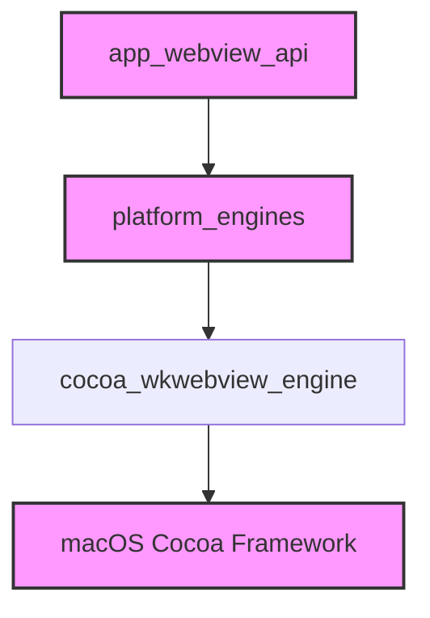

# cocoa_engine Module Documentation

## Introduction
The `cocoa_engine` module is a platform-specific implementation within the application's webview API layer, providing the core functionality for managing a WKWebView instance on macOS. It is responsible for initializing, controlling, and cleanly shutting down the webview and its associated Cocoa framework resources, ensuring proper integration with the macOS application lifecycle.

## Architecture and Component Relationships

The `cocoa_engine` module serves as the macOS-specific backend for the `platform_engines` module, which abstracts various webview implementations across different operating systems. It directly leverages the Cocoa framework and WebKit's WKWebView to render web content and handle user interactions on Apple devices.

### Components

The primary component of this module is:

*   **`cocoa_wkwebview_engine`**: This class encapsulates the logic for creating, managing, and destroying the WKWebView, NSWindow, and related delegates. The provided destructor highlights its critical role in resource deallocation and ensuring clean shutdown.

### Dependencies

The `cocoa_engine` module has the following key dependencies:

*   **`platform_engines`**: As a concrete implementation for macOS, it is a sub-module of `platform_engines`. For more details, refer to [platform_engines.md](platform_engines.md).
*   **`app_webview_api`**: It contributes to the overall webview API functionality by providing a platform-specific engine. For more details, refer to [app_webview_api.md](app_webview_api.md).
*   **macOS Cocoa Framework**: It directly interacts with Objective-C runtime and Cocoa classes (like `NSWindow`, `WKWebView`, `NSApplicationDelegate`, `NSWindowDelegate`) for its core operations.

<!-- DIAGRAM_JSON
{
    "direction": "TD",
    "nodes": [
        {"id": "cocoa_wkwebview_engine", "label": "cocoa_wkwebview_engine", "type": "component", "link": null},
        {"id": "platform_engines", "label": "platform_engines", "type": "external", "link": "platform_engines.md"},
        {"id": "app_webview_api", "label": "app_webview_api", "type": "external", "link": "app_webview_api.md"},
        {"id": "mac_os_cocoa_framework", "label": "macOS Cocoa Framework", "type": "external", "link": null}
    ],
    "edges": [
        {"source": "platform_engines", "target": "cocoa_wkwebview_engine"},
        {"source": "app_webview_api", "target": "platform_engines"},
        {"source": "cocoa_wkwebview_engine", "target": "mac_os_cocoa_framework"}
    ],
    "groups": []
}
-->

## Core Functionality

The `cocoa_engine` module, through its `cocoa_wkwebview_engine` component, focuses on the following key aspects:

### 1. WKWebView Lifecycle Management
The primary responsibility, as demonstrated by the provided destructor, is the proper deallocation and cleanup of WKWebView instances and their associated resources. This involves:
*   **WebView Detachment:** Removing the WKWebView from its parent window's content view.
*   **WebView Release:** Releasing the WKWebView object to free its memory.
*   **Window Management:** If the engine owns the window, it manages the window's closure, including detaching its delegate and triggering `on_window_destroyed` callbacks.
*   **Delegate Cleanup:** Releasing any custom window or application delegates that were created and assigned, and ensuring the application's delegate is reset to prevent dangling pointers.
*   **Event Loop Depletion:** Ensuring that pending events in the run loop are processed to allow immediate resource release, especially when the engine owns the window.

The `~cocoa_wkwebview_engine()` destructor meticulously handles the deallocation sequence:
1.  **`objc::autoreleasepool arp;`**: Establishes an autorelease pool to manage Objective-C objects that are autoreleased during the cleanup process.
2.  **`m_window` and `m_webview` cleanup**: Safely detaches the webview from the window and releases the webview object.
3.  **Window Ownership and Closure**: If the engine owns `m_window`, it sets the window's delegate to `nullptr` to prevent further callbacks during destruction, closes the window, and invokes `on_window_destroyed(true)`.
4.  **Delegate Release**: Releases `m_window_delegate` and `m_app_delegate` objects and resets the application's delegate.
5.  **Run Loop Management**: Calls `deplete_run_loop_event_queue()` to ensure all outstanding events are processed for immediate window closure and resource freeing.

This detailed cleanup process is crucial for preventing memory leaks and ensuring application stability when webview instances are created and destroyed.
