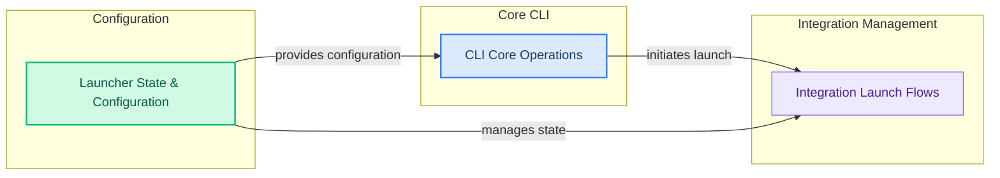

# Command Line Launchers
This module orchestrates various command-line interactions, enabling users to run models, manage integrations, and configure settings through interactive TUI or direct commands. It handles model embedding, creation, and pushing, alongside complex integration launch workflows involving policy-based model selection and configuration persistence.

<!-- DIAGRAM_JSON
{
    "direction": "LR",
    "nodes": [
        {
            "id": "cli_core_operations",
            "label": "CLI Core Operations",
            "type": "module",
            "link": "cli_core_operations.md"
        },
        {
            "id": "integration_launch_flows",
            "label": "Integration Launch Flows",
            "type": "module",
            "link": "integration_launch_flows.md"
        },
        {
            "id": "launcher_state_and_config",
            "label": "Launcher State & Configuration",
            "type": "module",
            "link": "launcher_state_and_config.md"
        }
    ],
    "edges": [
        {
            "source": "cli_core_operations",
            "target": "integration_launch_flows",
            "label": "initiates launch"
        },
        {
            "source": "launcher_state_and_config",
            "target": "cli_core_operations",
            "label": "provides configuration"
        },
        {
            "source": "launcher_state_and_config",
            "target": "integration_launch_flows",
            "label": "manages state"
        }
    ],
    "groups": [
        {
            "id": "core_cli",
            "label": "Core CLI",
            "role": "surface",
            "nodes": [
                "cli_core_operations"
            ]
        },
        {
            "id": "integration_management",
            "label": "Integration Management",
            "role": "analytical",
            "nodes": [
                "integration_launch_flows"
            ]
        },
        {
            "id": "configuration",
            "label": "Configuration",
            "role": "data",
            "nodes": [
                "launcher_state_and_config"
            ]
        }
    ]
}
-->
