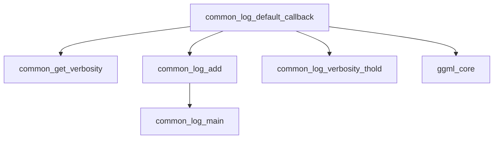

The `common_logging` module provides a standardized logging mechanism for the `llama.cpp` project, ensuring consistent log message handling, filtering, and output. It acts as a central point for managing log verbosity and routing log messages to their appropriate destinations.

### Purpose and Core Functionality

The primary purpose of the `common_logging` module is to offer a flexible and controllable logging system. It allows different parts of the application to emit log messages with varying verbosity levels. The core functionality revolves around:

1.  **Log Level Filtering**: Messages are filtered based on their severity level and a configured verbosity threshold, preventing less critical messages from cluttering the log output.
2.  **Default Log Callback**: Provides a default implementation for processing log messages, integrating with the core logging utilities.
3.  **Centralized Log Management**: Funnels log messages through a common interface, facilitating easier debugging and monitoring.

### Architecture and Component Relationships

The `common_logging` module's architecture is straightforward, focusing on a default logging callback that integrates with utility functions for verbosity control and message addition.

<!-- DIAGRAM_JSON
{
    "direction": "TD",
    "nodes": [
        {"id": "log_callback", "label": "common_log_default_callback", "type": "component", "link": null},
        {"id": "get_verbosity", "label": "common_get_verbosity", "type": "component", "link": null},
        {"id": "log_add", "label": "common_log_add", "type": "component", "link": null},
        {"id": "log_main", "label": "common_log_main", "type": "component", "link": null},
        {"id": "log_threshold", "label": "common_log_verbosity_thold", "type": "component", "link": null},
        {"id": "ggml_core", "label": "ggml_core", "type": "external", "link": "ggml_core.md"}
    ],
    "edges": [
        {"source": "log_callback", "target": "get_verbosity"},
        {"source": "log_callback", "target": "log_add"},
        {"source": "log_add", "target": "log_main"},
        {"source": "log_callback", "target": "log_threshold"},
        {"source": "log_callback", "target": "ggml_core"}
    ],
    "groups": []
}
-->

**Components:**

*   **`common_log_default_callback`**: This is the core component of the module. It acts as the entry point for log messages. It receives a `ggml_log_level`, a text message, and user data. It then determines if the message should be logged based on its verbosity.
*   **`common_get_verbosity`**: A utility function responsible for mapping a given `ggml_log_level` to an internal verbosity value, allowing for fine-grained control over what messages are displayed.
*   **`common_log_verbosity_thold`**: A module-level variable that defines the current logging verbosity threshold. Log messages with a verbosity level higher than this threshold will be filtered out.
*   **`common_log_add`**: This function is responsible for actually adding the formatted log message to the log stream, potentially with additional metadata like the log level.
*   **`common_log_main`**: This utility likely returns the main log instance or stream where messages are directed.

**External Dependencies:**

*   **`ggml_core`**: The logging mechanism uses `enum ggml_log_level` from the `ggml` library, indicating a direct dependency on the core `ggml` definitions for logging severity.

### How the Module Fits into the Overall System

The `common_logging` module is an integral part of the `llama.cpp_common` module, providing foundational logging capabilities for the entire `llama.cpp` project. Any component within `llama.cpp` that needs to emit log messages can leverage this module to ensure consistent and controlled output. By centralizing logging, it simplifies debugging, error tracking, and monitoring of the application's runtime behavior. Its reliance on `ggml_log_level` demonstrates its tight integration with the `ggml_core` framework, making it a critical utility for any `ggml`-based operations within `llama.cpp`.

This module abstracts the underlying logging implementation, allowing developers to simply call logging functions without needing to manage output streams or verbosity levels directly, as these are handled by the `common_logging` module's configuration and logic.