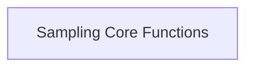

# Common Sampling Module

## Introduction

The `common_sampling` module provides fundamental utilities and core logic for token sampling within the `llama.cpp` project. It encapsulates mechanisms for sampling tokens from a set of probabilities and for converting character-based sampler configurations into recognized sampler types.

## Architecture Overview

The `common_sampling` module is designed to offer reusable sampling functionalities. It interacts with other parts of the `llama.cpp` ecosystem by providing essential token selection and sampler type resolution services.

<!-- DIAGRAM_JSON
{
    "direction": "TD",
    "nodes": [
        {"id": "sampling_core_functions", "label": "Sampling Core Functions", "type": "module", "link": "sampling_core_functions.md"}
    ],
    "edges": [],
    "groups": []
}
-->

## Sub-modules

### [Sampling Core Functions](sampling_core_functions.md)
This sub-module contains the primary functions responsible for token sampling and the conversion of character-based inputs into specific sampler types. It includes the logic for both the sampling process itself and the interpretation of sampling configuration parameters.