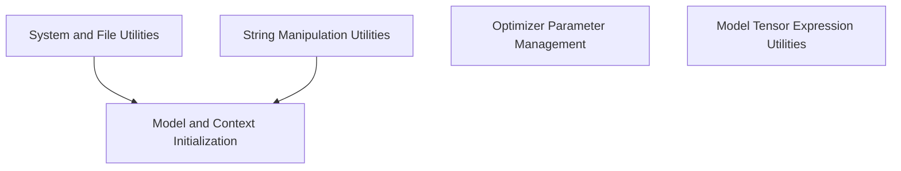

# Common Utilities (`common_utils`)

## Introduction
The `common_utils` module provides a collection of essential utility functions and helper components for the `llama.cpp` project. It encompasses functionalities ranging from system parameter handling and file system operations to string manipulation, model initialization, and optimization parameter management. This module aims to centralize commonly used functions to ensure consistency and reusability across the larger system.

## Architecture Overview
The `common_utils` module is structured into several distinct sub-modules, each focusing on a specific area of functionality. These sub-modules are designed to be loosely coupled, allowing for independent development and maintenance while providing critical services to other parts of the `llama.cpp` ecosystem.

<!-- DIAGRAM_JSON
{
    "direction": "TD",
    "nodes": [
        {"id": "system_utilities", "label": "System and File Utilities", "type": "module", "link": "system_utilities.md"},
        {"id": "model_initialization", "label": "Model and Context Initialization", "type": "module", "link": "model_initialization.md"},
        {"id": "model_tensor_utils", "label": "Model Tensor Expression Utilities", "type": "module", "link": "model_tensor_utils.md"},
        {"id": "string_manipulation", "label": "String Manipulation Utilities", "type": "module", "link": "string_manipulation.md"},
        {"id": "optimization_utilities", "label": "Optimizer Parameter Management", "type": "module", "link": "optimization_utilities.md"}
    ],
    "edges": [
        {"source": "model_initialization", "target": "system_utilities"},
        {"source": "model_initialization", "target": "string_manipulation"},
        {"source": "optimization_utilities", "target": "system_utilities"},
        {"source": "model_tensor_utils", "target": "string_manipulation"}
    ],
    "groups": []
}
-->

## Sub-modules
*   **[System and File Utilities](system_utilities.md)**: Manages CPU-related parameters, retrieves system information, and handles file system operations, particularly for cache management.
*   **[Model and Context Initialization](model_initialization.md)**: Handles the core logic for setting up Llama models and their contexts, including support for LORA adapters, control vectors, and model warmup routines.
*   **[Model Tensor Expression Utilities](model_tensor_utils.md)**: Provides tools for defining and overriding model tensor expressions, specifically for FFN blocks.
*   **[String Manipulation Utilities](string_manipulation.md)**: Offers a robust set of functions for various string operations, such as formatting, searching for partial sequences, joining strings, and detokenizing model outputs.
*   **[Optimizer Parameter Management](optimization_utilities.md)**: Contains functions for configuring and retrieving parameters related to model optimizers, including learning rates and optimizer types.
