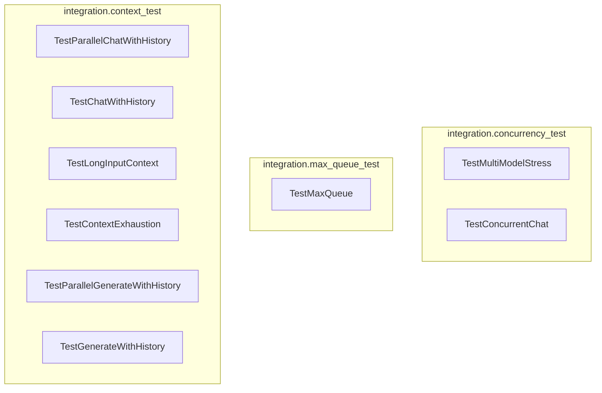

# Concurrency and Context Tests
This module contains integration tests for verifying concurrent operations, maximum queue handling, and various context management scenarios within the system.

<!-- DIAGRAM_JSON
{
  "nodes": [
    {
      "id": "A",
      "label": "TestMultiModelStress"
    },
    {
      "id": "B",
      "label": "TestConcurrentChat"
    },
    {
      "id": "C",
      "label": "TestMaxQueue"
    },
    {
      "id": "D",
      "label": "TestParallelChatWithHistory"
    },
    {
      "id": "E",
      "label": "TestChatWithHistory"
    },
    {
      "id": "F",
      "label": "TestLongInputContext"
    },
    {
      "id": "G",
      "label": "TestContextExhaustion"
    },
    {
      "id": "H",
      "label": "TestParallelGenerateWithHistory"
    },
    {
      "id": "I",
      "label": "TestGenerateWithHistory"
    }
  ],
  "edges": [],
  "groups": [
    {
      "id": "concurrency_test",
      "label": "integration.concurrency_test",
      "nodes": ["A", "B"]
    },
    {
      "id": "max_queue_test",
      "label": "integration.max_queue_test",
      "nodes": ["C"]
    },
    {
      "id": "context_test",
      "label": "integration.context_test",
      "nodes": ["D", "E", "F", "G", "H", "I"]
    }
  ]
}
-->
