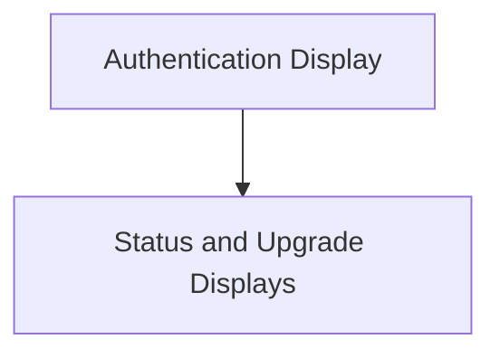

# Conditional Displays Module

## Introduction

The `conditional_displays` module is responsible for rendering various user interface components that appear conditionally based on application state, user authentication status, or system notifications. These displays provide important feedback and actionable prompts to the user, such as login requirements, model update availability, or upgrade notifications.

## Architecture

The module is structured into logical sub-modules, each focusing on a specific type of conditional display. This separation ensures maintainability and clarity of concerns.

<!-- DIAGRAM_JSON
{
    "direction": "TD",
    "nodes": [
        {"id": "authentication_display", "label": "Authentication Display", "type": "module", "link": "authentication_display.md"},
        {"id": "status_displays", "label": "Status and Upgrade Displays", "type": "module", "link": "status_displays.md"}
    ],
    "edges": [
        {"source": "authentication_display", "target": "status_displays"}
    ],
    "groups": []
}
-->

## Sub-modules

### [Authentication Display](authentication_display.md)
This sub-module manages displays related to user authentication, primarily the login prompt when cloud models require an Ollama account.

### [Status and Upgrade Displays](status_displays.md)
This sub-module handles various status-related messages, including notifications for available model updates and prompts for upgrading due to usage limits.
