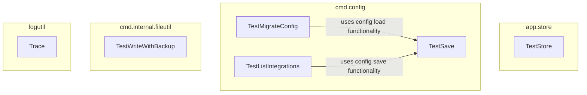

# configuration_and_utilities
This module provides core application configuration, state management, file utilities, and logging capabilities. It includes components for managing user settings, handling configuration migrations, performing safe file writes, and tracing execution.

<!-- DIAGRAM_JSON
{
  "nodes": [
    {"id": "A", "label": "TestStore"},
    {"id": "B", "label": "TestSave"},
    {"id": "C", "label": "TestListIntegrations"},
    {"id": "D", "label": "TestMigrateConfig"},
    {"id": "E", "label": "TestWriteWithBackup"},
    {"id": "F", "label": "Trace"}
  ],
  "edges": [
    {"source": "D", "target": "B", "label": "uses config load functionality"},
    {"source": "C", "target": "B", "label": "uses config save functionality"}
  ],
  "groups": [
    {"id": "app.store", "label": "app.store", "nodes": ["A"]},
    {"id": "cmd.config", "label": "cmd.config", "nodes": ["B", "C", "D"]},
    {"id": "cmd.internal.fileutil", "label": "cmd.internal.fileutil", "nodes": ["E"]},
    {"id": "logutil", "label": "logutil", "nodes": ["F"]}
  ]
}
-->
