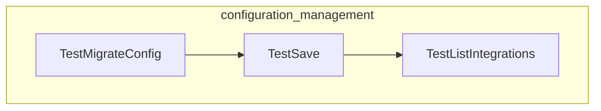

# configuration_management
This module handles the persistence, retrieval, and migration of application configuration, specifically managing integrations and their associated models. It ensures configuration data is correctly saved, loaded, listed, and updated across different versions or locations.

<!-- DIAGRAM_JSON
{
    "nodes": [
        {
            "id": "TestSave",
            "label": "TestSave"
        },
        {
            "id": "TestListIntegrations",
            "label": "TestListIntegrations"
        },
        {
            "id": "TestMigrateConfig",
            "label": "TestMigrateConfig"
        }
    ],
    "edges": [
        {
            "source": "TestMigrateConfig",
            "target": "TestSave"
        },
        {
            "source": "TestSave",
            "target": "TestListIntegrations"
        }
    ],
    "groups": [
        {
            "id": "configuration_management",
            "label": "configuration_management",
            "nodes": [
                "TestSave",
                "TestListIntegrations",
                "TestMigrateConfig"
            ]
        }
    ]
}
-->
