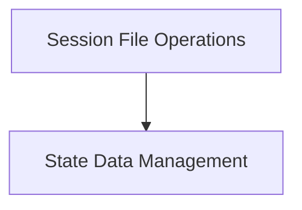

# Context State Management Module

## Introduction

The `context_state_management` module is a crucial part of the `llama.cpp` context handling, focusing on the persistence and manipulation of the internal state of a `llama_context`. It provides functions to save and load the full context state to and from files, as well as mechanisms to copy and retrieve the size of the state data in memory. This module ensures that the state of the language model can be effectively managed across different operations and sessions.

## Architecture

The `context_state_management` module is composed of two primary sub-modules, each responsible for a distinct aspect of state handling:

- **Session File Operations**: Manages the interaction with the file system for saving and loading the model's session state.
- **State Data Management**: Provides in-memory operations for copying, setting, and querying the size of the context's state data.

These sub-modules work together to provide a comprehensive solution for context state persistence and manipulation within the larger `llama_cpp_context`.

<!-- DIAGRAM_JSON
{
    "direction": "TD",
    "nodes": [
        {"id": "session_file_operations", "label": "Session File Operations", "type": "module", "link": "session_file_operations.md"},
        {"id": "state_data_management", "label": "State Data Management", "type": "module", "link": "state_data_management.md"}
    ],
    "edges": [
        {"source": "session_file_operations", "target": "state_data_management"}
    ],
    "groups": []
}
-->

## Sub-modules

### [Session File Operations](session_file_operations.md)

This sub-module is responsible for handling the serialization and deserialization of the `llama_context` state to and from persistent storage (files). It encapsulates the logic for loading existing sessions and saving the current state for future use.

### [State Data Management](state_data_management.md)

This sub-module provides utilities for in-memory manipulation of the `llama_context` state data. It allows for copying the state, setting new state data, and querying the size of the state, which is essential for memory allocation and buffer management.

