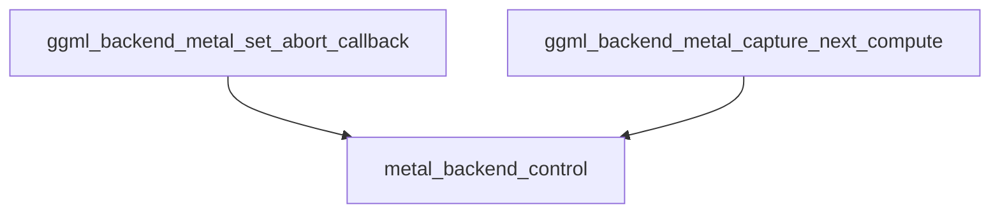

# control_and_debugging Module Documentation

## Introduction
The `control_and_debugging` module provides essential functionalities for controlling and debugging operations within the GGML Metal backend. It offers mechanisms to set an abort callback for ongoing Metal computations and to capture the next Metal compute command for profiling and diagnostic purposes. This module acts as a critical interface for developers to monitor and manage the execution flow and performance of GPU-accelerated tasks leveraging Apple's Metal API.

## Core Functionality
The primary responsibilities of this module include:
*   **Setting Abort Callbacks**: Allows external code to register a callback function that can be invoked to prematurely terminate Metal backend operations. This is crucial for implementing responsive cancellation features in applications.
*   **Capturing Compute Commands**: Provides a way to trigger the capture of the next Metal compute command encoder. This feature is invaluable for debugging, performance profiling, and analyzing the low-level Metal commands executed by the GGML Metal backend.

## Architecture and Component Relationships
This module is a leaf module within the `ggml_backend_metal` and specifically a child of the `metal_backend_control` module. Its components serve as high-level entry points that delegate their operations to the underlying Metal backend control mechanisms.

<!-- DIAGRAM_JSON
{
    "direction": "TD",
    "nodes": [
        {"id": "set_abort_callback", "label": "ggml_backend_metal_set_abort_callback", "type": "component", "link": null},
        {"id": "capture_compute", "label": "ggml_backend_metal_capture_next_compute", "type": "component", "link": null},
        {"id": "metal_backend_control", "label": "metal_backend_control", "type": "external", "link": "metal_backend_control.md"}
    ],
    "edges": [
        {"source": "set_abort_callback", "target": "metal_backend_control"},
        {"source": "capture_compute", "target": "metal_backend_control"}
    ],
    "groups": []
}
-->

The `ggml_backend_metal_set_abort_callback` function facilitates the registration of a custom abort function. This function is typically provided by the application layer to allow for graceful termination of long-running Metal computations. It internally calls a function within the [metal_backend_control](metal_backend_control.md) module to set the callback on the Metal context.

Similarly, the `ggml_backend_metal_capture_next_compute` function triggers a capture for the next compute pass on the Metal backend. This is primarily used for debugging and profiling with tools like Xcode's Metal debugger, allowing developers to inspect GPU command queues and resource usage. This function also delegates its operation to a corresponding function in the [metal_backend_control](metal_backend_control.md) module.

## How it Fits into the Overall System
The `control_and_debugging` module is an integral part of the `ggml_backend_metal` ecosystem. It extends the core Metal backend functionalities by providing essential hooks for runtime control and diagnostics. By offering explicit control over compute command capturing and the ability to define abort conditions, it enhances the stability, observability, and debuggability of GGML applications running on Apple hardware with Metal acceleration. It serves as a bridge between the high-level GGML graph execution and the low-level Metal API, allowing for fine-grained interaction and monitoring of GPU tasks.
