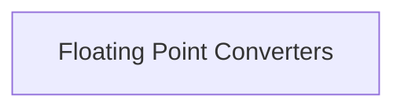

# Conversion Functions Module Documentation

## Introduction

The `conversion_functions` module is a vital component within the `ggml_internal_utils` module, specifically nested under `floating_point_conversions`. Its primary purpose is to provide essential utilities for converting between different floating-point precision formats, namely 16-bit (half-precision) and 32-bit (single-precision) floating-point numbers. These conversions are critical for optimizing memory usage and computation speed in machine learning operations, where half-precision can significantly reduce resource consumption while maintaining sufficient accuracy.

## Architecture

The `conversion_functions` module is structured around a single sub-module that encapsulates the core conversion logic.

<!-- DIAGRAM_JSON
{
    "direction": "TD",
    "nodes": [
        {"id": "floating_point_converters", "label": "Floating Point Converters", "type": "module", "link": "floating_point_converters.md"}
    ],
    "edges": [],
    "groups": []
}
-->

## Sub-modules

### [Floating Point Converters](floating_point_converters.md)
This sub-module contains the core logic for converting between 16-bit and 32-bit floating-point representations. It is essential for managing numerical precision across various computational tasks within the GGML framework.
