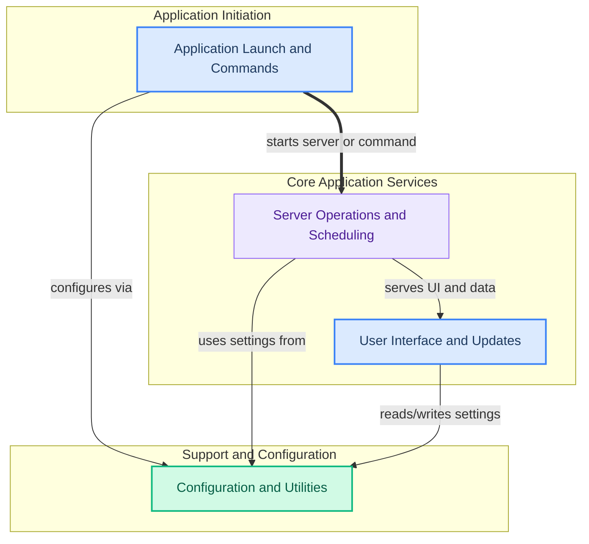

The `core_application` module serves as the central hub for the application, providing main entry points, managing server operations, handling user interface interactions and updates, and offering core configuration and utility services. It ensures the application's lifecycle, from launch to server management, user interaction, and system configuration, runs smoothly and efficiently for the user.

### How Components Work Together

The `core_application` module orchestrates several key functional areas to deliver a cohesive application experience. The application's lifecycle begins with its main entry points, which can launch the server or execute specific commands. The server then manages core operations, including model scheduling and request handling, while also serving the user interface. Throughout these processes, a dedicated module handles user interactions and ensures the application stays up-to-date. All these components rely on a central configuration and utilities module for settings, data persistence, and logging.

### Core Components Documentation

*   **[Main Entry Points](main_entry_points.md)**: Defines the primary execution paths for the application, including the core launcher and specialized command-line utilities.
*   **[Server Management](server_management.md)**: Manages the application server's lifecycle, inference information, cloud proxy, and model scheduling.
*   **[User Interface and Updates](user_interface_and_updates.md)**: Handles user interactions, desktop integration, and the automatic update mechanism for the application.
*   **[Configuration and Utilities](configuration_and_utilities.md)**: Provides general configuration management, file utilities, and logging capabilities for the entire application.