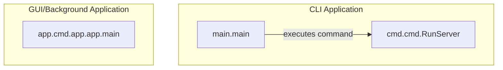

# core_application_launch
The `core_application_launch` module orchestrates the startup of the application, distinguishing between a command-line interface and a GUI/background launcher, handling argument parsing, logging, and server initialization.

<!-- DIAGRAM_JSON
{
  "nodes": [
    {
      "id": "CLI_Entrypoint",
      "label": "main.main"
    },
    {
      "id": "GUI_App_Launcher",
      "label": "app.cmd.app.app.main"
    },
    {
      "id": "Server_Command",
      "label": "cmd.cmd.RunServer"
    }
  ],
  "edges": [
    {
      "source": "CLI_Entrypoint",
      "target": "Server_Command",
      "label": "executes command"
    }
  ],
  "groups": [
    {
      "id": "CLI_Application",
      "label": "CLI Application",
      "nodes": ["CLI_Entrypoint", "Server_Command"]
    },
    {
      "id": "GUI_Background_Application",
      "label": "GUI/Background Application",
      "nodes": ["GUI_App_Launcher"]
    }
  ]
}
-->
