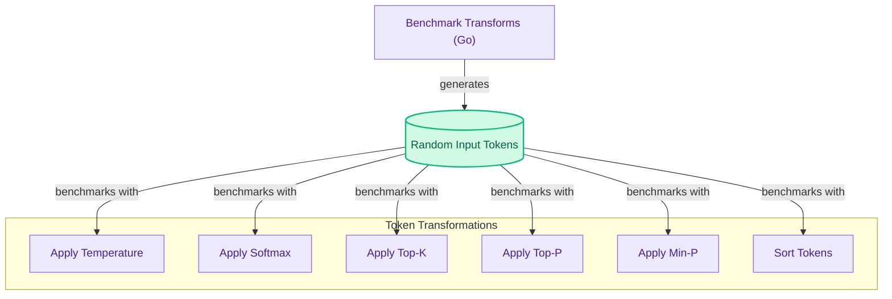

# Core ML Transform Benchmarking
This module benchmarks core machine learning token transformation functions like temperature scaling, softmax, top-k, top-p, and min-p sampling, crucial for evaluating the performance of inference post-processing.
<!-- DIAGRAM_JSON
{
    "direction": "TD",
    "nodes": [
        {"id": "benchmark_runner", "label": "Benchmark Transforms (Go)", "type": "component", "link": null},
        {"id": "input_tokens", "label": "Random Input Tokens", "type": "data", "link": null},
        {"id": "temperature", "label": "Apply Temperature", "type": "component", "link": null},
        {"id": "softmax", "label": "Apply Softmax", "type": "component", "link": null},
        {"id": "topk", "label": "Apply Top-K", "type": "component", "link": null},
        {"id": "topp", "label": "Apply Top-P", "type": "component", "link": null},
        {"id": "minp", "label": "Apply Min-P", "type": "component", "link": null},
        {"id": "sort_tokens", "label": "Sort Tokens", "type": "component", "link": null}
    ],
    "edges": [
        {"source": "benchmark_runner", "target": "input_tokens", "label": "generates"},
        {"source": "input_tokens", "target": "temperature", "label": "benchmarks with"},
        {"source": "input_tokens", "target": "softmax", "label": "benchmarks with"},
        {"source": "input_tokens", "target": "topk", "label": "benchmarks with"},
        {"source": "input_tokens", "target": "topp", "label": "benchmarks with"},
        {"source": "input_tokens", "target": "minp", "label": "benchmarks with"},
        {"source": "input_tokens", "target": "sort_tokens", "label": "benchmarks with"}
    ],
    "groups": [
        {"id": "ml_transforms", "label": "Token Transformations", "role": "analytical", "nodes": ["temperature", "softmax", "topk", "topp", "minp", "sort_tokens"]}
    ]
}
-->
