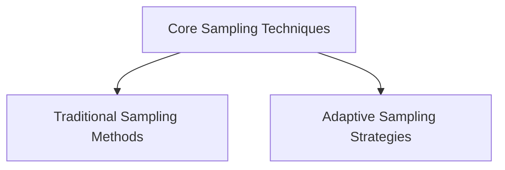

# Core Sampling Techniques

## Introduction
The `core_sampling_techniques` module is a fundamental component within the `llama_cpp_sampling` system, providing a suite of algorithms for selecting the next token during text generation. This module encapsulates various strategies, from established methods like Top-K and Top-P to more advanced adaptive techniques such as Mirostat and dynamic temperature scaling. Its primary purpose is to enable flexible and nuanced control over the generative process, influencing the diversity, coherence, and quality of the model's output.

## Architecture
The module is structured to offer a clear separation of concerns, with different sub-modules dedicated to specific categories of sampling techniques. This modular design facilitates the integration of new sampling algorithms and simplifies maintenance.

<!-- DIAGRAM_JSON
{
    "direction": "TD",
    "nodes": [
        {"id": "traditional_sampling", "label": "Traditional Sampling Methods", "type": "module", "link": "traditional_sampling.md"},
        {"id": "adaptive_sampling", "label": "Adaptive Sampling Strategies", "type": "module", "link": "adaptive_sampling.md"}
    ],
    "edges": [
        {"source": "core_sampling_techniques", "target": "traditional_sampling"},
        {"source": "core_sampling_techniques", "target": "adaptive_sampling"}
    ],
    "groups": []
}
-->

### Sub-modules

*   **[Traditional Sampling Methods](traditional_sampling.md)**: This sub-module focuses on foundational token selection techniques that filter or re-weight token probabilities based on simple, predefined criteria. It includes methods like Top-K, Top-P, and Min-P, which are widely used for controlling the breadth of potential next tokens.

*   **[Adaptive Sampling Strategies](adaptive_sampling.md)**: This sub-module provides more sophisticated and dynamic sampling algorithms. These techniques adapt their behavior based on the ongoing generation process or statistical properties of the token distribution, aiming to achieve a balance between creativity and coherence. It encompasses methods such as Mirostat, dynamic temperature scaling, XTC, and Top-N Sigma sampling.
