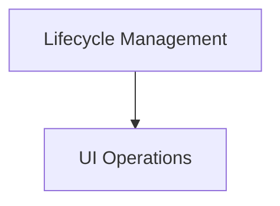

# core_webview_operations Module Documentation

## Introduction

The `core_webview_operations` module provides the foundational functionalities for managing a webview instance within the application. It encapsulates core operations related to the webview's lifecycle, user interface manipulation, and event handling, serving as the primary interface for interacting with the webview component.

## Architecture Overview

This module is structured into key sub-modules that handle distinct aspects of webview management, promoting a clear separation of concerns and maintainability. The core functionalities revolve around the webview's operational lifecycle and its visual representation and interaction.

<!-- DIAGRAM_JSON
{
    "direction": "TD",
    "nodes": [
        {"id": "lifecycle_management", "label": "Lifecycle Management", "type": "module", "link": "lifecycle_management.md"},
        {"id": "ui_operations", "label": "UI Operations", "type": "module", "link": "ui_operations.md"}
    ],
    "edges": [
        {"source": "lifecycle_management", "target": "ui_operations"}
    ],
    "groups": []
}
-->

## High-Level Functionality

### [Lifecycle Management](lifecycle_management.md)

This sub-module is responsible for the overall control and state management of the webview, from its initialization and launching to its termination and event dispatching. It ensures the webview integrates correctly into the application's runtime environment.

### [UI Operations](ui_operations.md)

The `ui_operations` sub-module handles all interactions related to the webview's visual presentation and user-facing elements. This includes setting the window title, loading HTML content, managing window dimensions, and controlling the zoom level, providing a comprehensive API for customizing the webview's appearance and behavior.