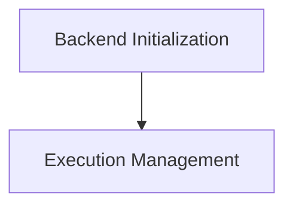

# CPU Backend API Documentation

## Introduction

The `cpu_backend_api` module provides the core interface for interacting with the GGML CPU backend. It encapsulates functionalities for initializing the CPU device, managing graph execution plans, and configuring operational parameters like thread counts and abort callbacks. This module is crucial for enabling efficient computation on the CPU, serving as the bridge between the higher-level GGML framework and the underlying CPU hardware.

## Architecture Overview

The `cpu_backend_api` module is composed of several key sub-modules, each responsible for a specific aspect of CPU backend management. The architecture is designed to provide a clear separation of concerns, allowing for modular development and easier maintenance. The main interactions within this module involve setting up the CPU environment, planning computational graphs, and querying device capabilities.

<!-- DIAGRAM_JSON
{
    "direction": "TD",
    "nodes": [
        {"id": "backend_initialization", "label": "Backend Initialization", "type": "module", "link": "backend_initialization.md"},
        {"id": "execution_management", "label": "Execution Management", "type": "module", "link": "execution_management.md"}
    ],
    "edges": [
        {"source": "backend_initialization", "target": "execution_management"}
    ],
    "groups": []
}
-->

## Sub-modules

### [Backend Initialization](backend_initialization.md)
This sub-module focuses on the initial setup of the CPU backend, including the initialization of the backend context and retrieval of device-specific properties.

### [Execution Management](execution_management.md)
This sub-module handles the planning and control of computational graph execution on the CPU, as well as managing thread settings and abort mechanisms.