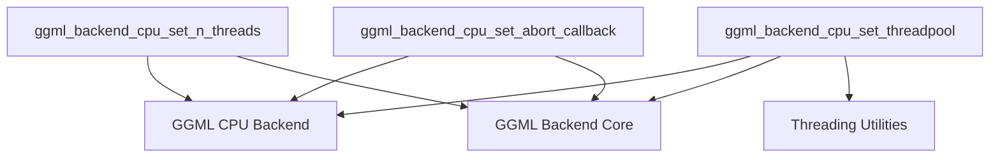

# CPU Backend Configuration Module

This module (`cpu_backend_configuration`) is a sub-module of `runtime_configuration`, `execution_management`, and ultimately the [GGML CPU Backend](ggml_cpu_backend.md). It provides essential functions for configuring the operational parameters of the GGML CPU backend, specifically focusing on thread management and the handling of asynchronous abort signals. This ensures optimal performance and responsiveness by allowing developers to control the number of threads used, integrate custom thread pools, and define callbacks for graceful termination.

## Architecture and Component Relationships

The `cpu_backend_configuration` module exposes a set of functions that directly manipulate the internal state of a `ggml_backend_cpu_context`. This context is the core data structure representing an instance of the GGML CPU backend, managed by the parent [GGML CPU Backend](ggml_cpu_backend.md) module.

### Core Components

*   `ggml_backend_cpu_set_n_threads`: Sets the number of threads for the CPU backend.
*   `ggml_backend_cpu_set_threadpool`: Assigns a custom thread pool to the CPU backend, allowing for flexible thread management.
*   `ggml_backend_cpu_set_abort_callback`: Configures a callback function and associated data to handle abort signals, enabling graceful termination of ongoing operations.

### Dependencies

*   **[GGML Backend Core](ggml_backend_core.md)**: Provides the fundamental `ggml_backend_t` type and the `ggml_backend_is_cpu` utility function used for type assertion and validation across all configuration functions.
*   **[GGML CPU Backend](ggml_cpu_backend.md)**: The parent module that manages the `ggml_backend_cpu_context`, which is directly configured by the functions in this module.
*   **Threading Utilities (Conceptual)**: While not a distinct module in the provided tree, the `ggml_threadpool_t` type and the `ggml_threadpool_pause` function imply a dependency on a threading utility or common library responsible for thread pool management.

<!-- DIAGRAM_JSON
{
    "direction": "TD",
    "nodes": [
        {"id": "set_n_threads", "label": "ggml_backend_cpu_set_n_threads", "type": "component", "link": null},
        {"id": "set_threadpool", "label": "ggml_backend_cpu_set_threadpool", "type": "component", "link": null},
        {"id": "set_abort_callback", "label": "ggml_backend_cpu_set_abort_callback", "type": "component", "link": null},
        {"id": "ggml_cpu_backend", "label": "GGML CPU Backend", "type": "external", "link": "ggml_cpu_backend.md"},
        {"id": "ggml_backend_core", "label": "GGML Backend Core", "type": "external", "link": "ggml_backend_core.md"},
        {"id": "threading_utilities", "label": "Threading Utilities", "type": "external", "link": "threading_utilities.md"}
    ],
    "edges": [
        {"source": "set_n_threads", "target": "ggml_cpu_backend"},
        {"source": "set_n_threads", "target": "ggml_backend_core"},
        {"source": "set_threadpool", "target": "ggml_cpu_backend"},
        {"source": "set_threadpool", "target": "ggml_backend_core"},
        {"source": "set_threadpool", "target": "threading_utilities"},
        {"source": "set_abort_callback", "target": "ggml_cpu_backend"},
        {"source": "set_abort_callback", "target": "ggml_backend_core"}
    ],
    "groups": []
}
-->


## Functionality Details

### `ggml_backend_cpu_set_n_threads`

```cpp
void ggml_backend_cpu_set_n_threads(ggml_backend_t backend_cpu, int n_threads) {
    GGML_ASSERT(ggml_backend_is_cpu(backend_cpu));
    struct ggml_backend_cpu_context * ctx = (struct ggml_backend_cpu_context *)backend_cpu->context;
    ctx->n_threads = n_threads;
}
```

This function sets the number of threads to be used by the CPU backend for computations. It takes a `ggml_backend_t` instance, which must be a CPU backend, and an integer `n_threads` specifying the desired number of threads. This directly impacts the parallelism and performance of operations executed on the CPU backend.

### `ggml_backend_cpu_set_threadpool`

```cpp
void ggml_backend_cpu_set_threadpool(ggml_backend_t backend_cpu, ggml_threadpool_t threadpool) {
    GGML_ASSERT(ggml_backend_is_cpu(backend_cpu));
    struct ggml_backend_cpu_context * ctx = (struct ggml_backend_cpu_context *)backend_cpu->context;
    if (ctx->threadpool && ctx->threadpool != threadpool) {
        ggml_threadpool_pause(ctx->threadpool);
    }
    ctx->threadpool = threadpool;
}
```

This function allows for the assignment of a custom thread pool to the CPU backend. It takes a `ggml_backend_t` instance and a `ggml_threadpool_t` handle. If a different thread pool was previously set, it will be paused before the new one is assigned. This provides advanced control over thread management, enabling integration with existing threading solutions or custom scheduling policies.

### `ggml_backend_cpu_set_abort_callback`

```cpp
void ggml_backend_cpu_set_abort_callback(ggml_backend_t backend_cpu, ggml_abort_callback abort_callback, void * abort_callback_data) {
    GGML_ASSERT(ggml_backend_is_cpu(backend_cpu));
    struct ggml_backend_cpu_context * ctx = (struct ggml_backend_cpu_context *)backend_cpu->context;
    ctx->abort_callback = abort_callback;
    ctx->abort_callback_data = abort_callback_data;
}
```

This function registers an abort callback function and its associated data with the CPU backend. The `ggml_abort_callback` function will be invoked when an operation needs to be gracefully terminated. This mechanism is crucial for implementing cancellation features or handling external signals, allowing for responsive and controlled shutdown of long-running computations. The `abort_callback_data` pointer can be used to pass any necessary context to the callback function.
