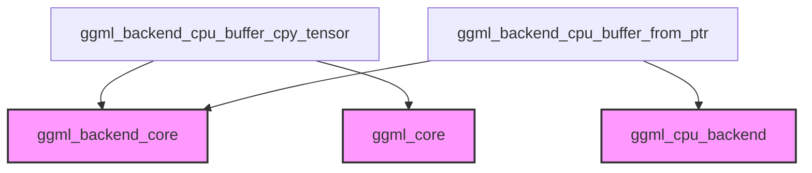

# cpu_buffer_operations Module Documentation

## Introduction
The `cpu_buffer_operations` module provides fundamental functionalities for managing and manipulating CPU-resident buffers within the GGML backend. It includes core operations such as copying tensor data between CPU buffers and initializing new CPU buffers from raw memory pointers. These functions are crucial for efficient data handling and memory alignment in CPU-based tensor computations.

## Architecture and Component Relationships

The `cpu_buffer_operations` module is a leaf module responsible for low-level CPU buffer interactions. It resides under `ggml_backend_core`'s `data_transfer_and_comparison` section, specifically within `tensor_transfer`. Its components directly interact with core GGML structures and backend buffer management.

<!-- DIAGRAM_JSON
{
    "direction": "TD",
    "nodes": [
        {"id": "cpy_tensor", "label": "ggml_backend_cpu_buffer_cpy_tensor", "type": "component", "link": null},
        {"id": "from_ptr", "label": "ggml_backend_cpu_buffer_from_ptr", "type": "component", "link": null},
        {"id": "ggml_backend_core_module", "label": "ggml_backend_core", "type": "external", "link": "ggml_backend_core.md"},
        {"id": "ggml_core_module", "label": "ggml_core", "type": "external", "link": "ggml_core.md"},
        {"id": "ggml_cpu_backend_module", "label": "ggml_cpu_backend", "type": "external", "link": "ggml_cpu_backend.md"}
    ],
    "edges": [
        {"source": "cpy_tensor", "target": "ggml_backend_core_module"},
        {"source": "cpy_tensor", "target": "ggml_core_module"},
        {"source": "from_ptr", "target": "ggml_backend_core_module"},
        {"source": "from_ptr", "target": "ggml_cpu_backend_module"}
    ],
    "groups": []
}
-->


## Core Functionality

### `ggml_backend_cpu_buffer_cpy_tensor`
This function is responsible for copying the data of a source tensor (`src`) to a destination tensor (`dst`) within the CPU backend. It specifically handles cases where the source tensor's buffer is host-resident, performing a direct memory copy. This ensures efficient data transfer for tensors already located in host memory.

**Source File:** `ml/backend/ggml/ggml/src/ggml-backend.cpp`
**Lines:** 2247-2256

```cpp
static bool ggml_backend_cpu_buffer_cpy_tensor(ggml_backend_buffer_t buffer, const struct ggml_tensor * src, struct ggml_tensor * dst) {
    GGML_ASSERT(src);
    if (ggml_backend_buffer_is_host(src->buffer)) {
        memcpy(dst->data, src->data, ggml_nbytes(src));
        return true;
    }
    return false;

    GGML_UNUSED(buffer);
}
```

### `ggml_backend_cpu_buffer_from_ptr`
This function initializes a new CPU backend buffer from a provided raw memory pointer (`ptr`) and a specified size (`size`). It includes an assertion to ensure that the provided pointer is properly aligned, which is critical for performance and correctness in memory operations. This function is essential for creating GGML-compatible buffers from pre-allocated memory regions.

**Source File:** `ml/backend/ggml/ggml/src/ggml-backend.cpp`
**Lines:** 2360-2363

```cpp
ggml_backend_buffer_t ggml_backend_cpu_buffer_from_ptr(void * ptr, size_t size) {
    GGML_ASSERT((uintptr_t)ptr % TENSOR_ALIGNMENT == 0 && "buffer pointer must be aligned");
    return ggml_backend_buffer_init(ggml_backend_cpu_buffer_from_ptr_type(), ggml_backend_cpu_buffer_from_ptr_i, ptr, size);
}
```

## Integration with the Overall System
The `cpu_buffer_operations` module is a foundational component of the [ggml_cpu_backend](ggml_cpu_backend.md). It provides the basic mechanisms for moving and managing tensor data on the CPU.
It relies on definitions from [ggml_core](ggml_core.md) for tensor structures and size calculations, and it utilizes the broader buffer management framework defined within [ggml_backend_core](ggml_backend_core.md) for initializing backend buffers and checking buffer properties.
Any higher-level operations within the `ggml_cpu_backend` that require copying data between CPU-resident tensors or creating new CPU buffers from raw pointers will directly or indirectly leverage the functionalities provided by this module.
