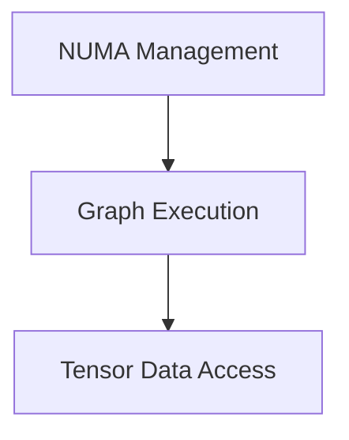

# CPU Graph and Data Access Module

## Introduction

The `cpu_graph_and_data_access` module is a core component within the `ggml_cpu_backend` responsible for managing computational graph execution, optimizing memory access, and providing efficient tensor data manipulation on the CPU. It plays a crucial role in the performance of GGML operations by orchestrating how computational graphs are processed and how data is accessed and modified in memory.

## Architecture Overview

This module is structured into several sub-modules, each focusing on a specific aspect of CPU-based graph computation and data handling. The interaction between these sub-modules ensures efficient resource utilization and data flow.

<!-- DIAGRAM_JSON
{
    "direction": "TD",
    "nodes": [
        {"id": "graph_execution", "label": "Graph Execution", "type": "module", "link": "graph_execution.md"},
        {"id": "tensor_data_access", "label": "Tensor Data Access", "type": "module", "link": "tensor_data_access.md"},
        {"id": "numa_management", "label": "NUMA Management", "type": "module", "link": "numa_management.md"}
    ],
    "edges": [
        {"source": "graph_execution", "target": "tensor_data_access"},
        {"source": "numa_management", "target": "graph_execution"}
    ],
    "groups": []
}
-->

## Sub-modules

### [Graph Execution](graph_execution.md)
This sub-module is responsible for the overall computation and execution of the GGML computational graph. It includes functions for planning and executing the graph, as well as managing secondary threads for parallel computation to maximize CPU utilization.

### [Tensor Data Access](tensor_data_access.md)
This sub-module provides fundamental utilities for efficient reading and writing of data within 1D tensors. It supports various data types (integers and floats) and handles both contiguous and non-contiguous tensor memory layouts, ensuring flexible and optimized data manipulation.

### [NUMA Management](numa_management.md)
Dedicated to Non-Uniform Memory Access (NUMA) initialization and management, this sub-module optimizes memory and CPU core allocation. By configuring NUMA strategy, it helps in reducing memory latency and improving computational performance, especially on multi-socket systems.