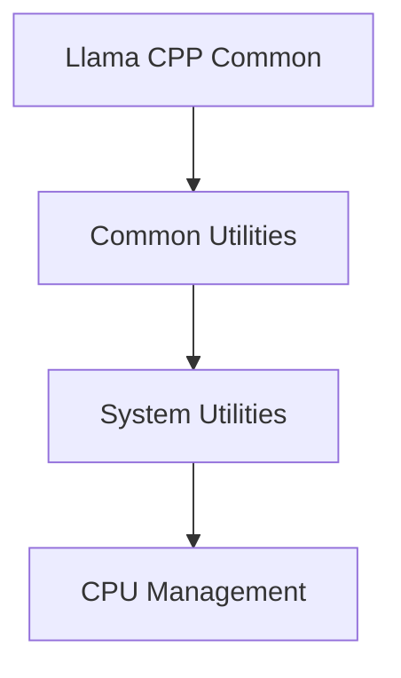

# CPU Management Module

## Introduction and Purpose
The `cpu_management` module is a critical component within the `llama_cpp_common` library, specifically nested under `system_utilities`. Its primary purpose is to manage and report CPU-related parameters, ensuring optimal thread utilization and providing detailed system information. This module plays a vital role in configuring the `llama.cpp` project for efficient performance by intelligently handling CPU thread counts and mask settings.

## Architecture Overview
The `cpu_management` module is a leaf module within the `system_utilities` and `common_utils` hierarchy. It directly interacts with system-level CPU information to configure and validate CPU parameters. Its functions are called by higher-level components that require CPU configuration or system details.

<!-- DIAGRAM_JSON
{
    "direction": "TD",
    "nodes": [
        {"id": "llama_cpp_common", "label": "Llama CPP Common", "type": "module", "link": "llama_cpp_common.md"},
        {"id": "common_utils", "label": "Common Utilities", "type": "module", "link": "common_utils.md"},
        {"id": "system_utilities", "label": "System Utilities", "type": "module", "link": "system_utilities.md"},
        {"id": "cpu_management", "label": "CPU Management", "type": "module", "link": "cpu_management.md"}
    ],
    "edges": [
        {"source": "llama_cpp_common", "target": "common_utils"},
        {"source": "common_utils", "target": "system_utilities"},
        {"source": "system_utilities", "target": "cpu_management"}
    ],
    "groups": []
}
-->

## High-Level Functionality

### `postprocess_cpu_params`
This function is responsible for adjusting and validating CPU parameters, primarily focusing on the number of threads (`n_threads`). It ensures that the requested thread count is appropriate for the system's capabilities or defaults to the number of available math CPUs if no specific configuration is provided. It also logs warnings if the CPU mask does not align with the desired thread count, indicating potential performance issues.

**Component ID:** `llama.llama.cpp.common.common.postprocess_cpu_params`

### `common_params_get_system_info`
This utility function gathers and formats comprehensive system information related to CPU usage. It reports the total number of threads configured for both general and batch processing. Depending on the operating system, it leverages platform-specific APIs (e.g., `GetActiveProcessorCount` on Windows) or standard C++ features (`std::thread::hardware_concurrency`) to provide details about the hardware's concurrency capabilities, along with additional system information from `llama_print_system_info()`.

**Component ID:** `llama.llama.cpp.common.common.common_params_get_system_info`
