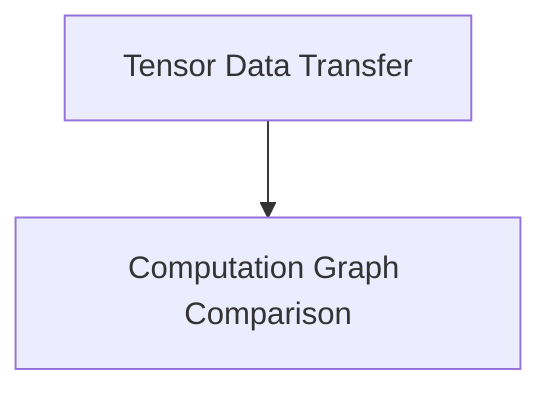

# Data Transfer and Comparison Module

## Introduction

The `data_transfer_and_comparison` module is a crucial component within the `ggml_backend_core` responsible for managing the movement of tensor data between different backend devices and facilitating the comparison of computation graphs. This module ensures efficient and reliable data handling, which is essential for operations like model loading, intermediate result transfer, and backend verification.

## Architecture Overview

The module is structured into two main sub-modules: `graph_comparison` and `tensor_transfer`. These sub-modules work in concert to provide robust data management and validation capabilities within the GGML backend system.

<!-- DIAGRAM_JSON
{
    "direction": "TD",
    "nodes": [
        {"id": "graph_comparison", "label": "Computation Graph Comparison", "type": "module", "link": "graph_comparison.md"},
        {"id": "tensor_transfer", "label": "Tensor Data Transfer", "type": "module", "link": "tensor_transfer.md"}
    ],
    "edges": [
        {"source": "tensor_transfer", "target": "graph_comparison"}
    ],
    "groups": []
}
-->

## Sub-modules

### [Tensor Data Transfer](tensor_transfer.md)

This sub-module focuses on the efficient transfer of tensor data across different GGML backends. It provides functionalities for both asynchronous and synchronous copying of tensor data, as well as the initialization of CPU-specific buffers from raw pointers. This is vital for moving data between CPU and GPU backends or between different GPU contexts, ensuring that data is correctly aligned and accessible for computation.

### [Computation Graph Comparison](graph_comparison.md)

The `graph_comparison` sub-module is designed to compare the execution and results of two computation graphs, typically across different backends. This functionality is essential for verifying the correctness of backend implementations, debugging, and ensuring consistent behavior when porting models or operations to new hardware or backend environments. It can compare entire graphs or specific test nodes within them, providing detailed feedback through a callback mechanism.
