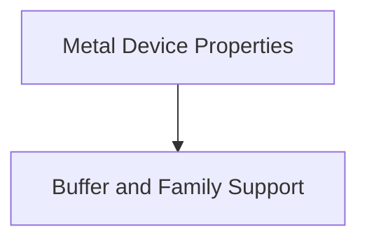

# Device Management

The `device_management` module is a crucial part of the `ggml-metal` backend, responsible for interacting with and managing Apple Metal devices. It provides core functionalities for querying device properties, determining supported buffer types, and verifying device family compatibility. This module ensures that the `ggml` framework can effectively utilize Metal GPU capabilities for optimized performance.

## Architecture

The `device_management` module is composed of several key sub-modules that handle distinct aspects of device interaction:

-   **[Metal Device Properties](device_properties.md)**: Focuses on retrieving detailed information about the Metal devices.
-   **[Buffer and Family Support](buffer_and_family_support.md)**: Manages the identification of supported buffer types and verifies device family support.

These sub-modules work in conjunction to provide a robust interface for the `ggml` backend to manage and utilize Metal devices efficiently.

<!-- DIAGRAM_JSON
{
    "direction": "TD",
    "nodes": [
        {"id": "device_properties", "label": "Metal Device Properties", "type": "module", "link": "device_properties.md"},
        {"id": "buffer_and_family_support", "label": "Buffer and Family Support", "type": "module", "link": "buffer_and_family_support.md"}
    ],
    "edges": [
        {"source": "device_properties", "target": "buffer_and_family_support"}
    ],
    "groups": []
}
-->

