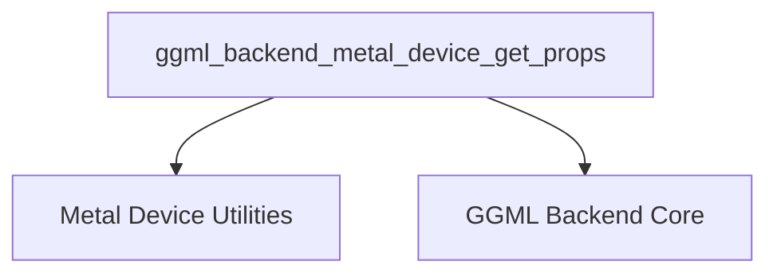

# device_properties

The `device_properties` module is a crucial component within the `ggml_backend_metal` framework, specifically responsible for querying and reporting the essential properties and capabilities of a Metal backend device. It serves as an interface to retrieve detailed information necessary for effective device management and resource allocation.

### Purpose and Core Functionality

The primary purpose of the `device_properties` module is to encapsulate the logic for gathering comprehensive information about a specific Metal device. This includes:

*   **Identification:** Retrieving the device's name, description, and a unique identifier.
*   **Type Information:** Determining the backend type.

*   **Memory Statistics:** Providing details on both free and total memory available on the device.
*   **Capabilities:** Reporting specific operational capabilities, such as asynchronous operations support, host buffer capabilities, and event handling.

This information is vital for the GGML backend to make informed decisions regarding tensor allocation, operation scheduling, and overall performance optimization tailored to the specific hardware capabilities of the Metal device.

### Architecture and Component Relationships

The `device_properties` module, although small in its direct implementation, acts as an aggregator of information from various lower-level Metal backend utilities.
Its core component, `ggml_backend_metal_device_get_props`, orchestrates calls to other functions to compile the complete device property set.

<!-- DIAGRAM_JSON
{
    "direction": "TD",
    "nodes": [
        {"id": "get_props", "label": "ggml_backend_metal_device_get_props", "type": "component", "link": null},
        {"id": "metal_utils", "label": "Metal Device Utilities", "type": "external", "link": "metal_device_utilities.md"},
        {"id": "backend_core", "label": "GGML Backend Core", "type": "external", "link": "ggml_backend_core.md"}
    ],
    "edges": [
        {"source": "get_props", "target": "metal_utils"},
        {"source": "get_props", "target": "backend_core"}
    ],
    "groups": []
}
-->

**Key Components:**

*   **`ggml_backend_metal_device_get_props`**: This is the central function that takes a Metal device handle (`ggml_backend_dev_t dev`) and a pointer to a `ggml_backend_dev_props` structure. It populates the structure with the device's properties.
*   **Metal Device Utilities ([metal_device_utilities.md](metal_device_utilities.md))**: This external module provides the atomic functions to retrieve individual device attributes like name, description, type, and memory statistics (e.g., `ggml_backend_metal_device_get_name`, `ggml_backend_metal_device_get_memory`). The `device_properties` module depends heavily on these utilities for data acquisition.
*   **GGML Backend Core ([ggml_backend_core.md](ggml_backend_core.md))**: This module defines the generic `ggml_backend_dev_props` structure, which serves as a standardized contract for all GGML backend implementations to report their device properties. The `device_properties` module populates an instance of this structure.

### How the Module Fits into the Overall System

The `device_properties` module is an integral part of the `device_management` sub-module within `ggml_backend_metal`. It plays a critical role in the initialization and setup phases of the Metal backend by providing the necessary hardware context.

When the GGML system initializes a Metal device, it will call `ggml_backend_metal_device_get_props` to understand the capabilities and limitations of the available hardware. This information is then used by higher-level GGML components for:

1.  **Backend Selection**: Deciding if the Metal device meets the requirements for a specific task.
2.  **Resource Planning**: Allocating buffers and managing memory based on reported free/total memory.
3.  **Feature Toggling**: Enabling or disabling certain operations based on reported capabilities (e.g., if asynchronous operations are supported).

By centralizing the device property retrieval, this module ensures consistency and simplifies the process of integrating Metal devices into the broader GGML ecosystem.