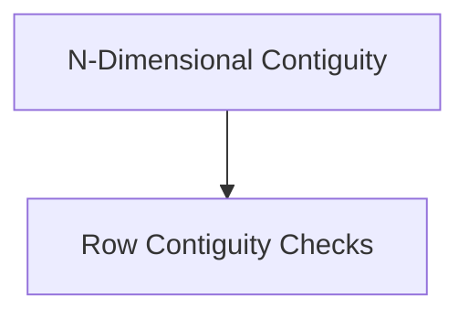

# Dimension Specific Contiguity Checks

This module, `dimension_specific_checks`, is a core part of the `ggml_core` library, specifically nested within `ggml_tensor_properties` and `contiguity_checks`. Its primary purpose is to provide highly optimized functions for verifying the contiguity of tensor data along specific dimensions or for entire rows. This is crucial for efficient memory access and computation within the GGML framework, ensuring that tensor operations can leverage contiguous memory blocks where possible.

## Architecture Overview

The `dimension_specific_checks` module is composed of two main sub-modules, each focusing on a distinct aspect of tensor contiguity verification:

- **N-Dimensional Contiguity**: Handles checks for contiguity up to a specified number of dimensions.
- **Row Contiguity Checks**: Focuses on verifying if the rows of a tensor are contiguous.

These sub-modules interact directly with the underlying GGML tensor structure to determine memory layout characteristics.

<!-- DIAGRAM_JSON
{
    "direction": "TD",
    "nodes": [
        {"id": "n_dimensional_contiguity", "label": "N-Dimensional Contiguity", "type": "module", "link": "n_dimensional_contiguity.md"},
        {"id": "row_contiguity_checks", "label": "Row Contiguity Checks", "type": "module", "link": "row_contiguity_checks.md"}
    ],
    "edges": [
        {"source": "n_dimensional_contiguity", "target": "row_contiguity_checks"}
    ],
    "groups": []
}
-->

## Sub-modules

### [N-Dimensional Contiguity](n_dimensional_contiguity.md)
This sub-module provides functions to check tensor contiguity for specific dimensions, leveraging a general N-dimensional check. It includes checks for 1-dimensional and 2-dimensional contiguity (`ggml_is_contiguous_1`, `ggml_is_contiguous_2`).

### [Row Contiguity Checks](row_contiguity_checks.md)
This sub-module contains a utility function to determine if a tensor's rows are physically contiguous in memory (`ggml_is_contiguous_rows`). This is particularly useful for operations that process tensors row by row.

## Integration with `ggml_core`

The `dimension_specific_checks` module is an integral part of the `ggml_core` module, specifically contributing to the [ggml_tensor_properties](ggml_tensor_properties.md) and [contiguity_checks](contiguity_checks.md) sub-modules. It provides fundamental checks that are utilized by higher-level tensor operations to ensure data integrity and optimize performance. Its functions are called extensively throughout the GGML framework to validate tensor layouts before performing computations.

For more details on tensor properties within GGML, refer to the [ggml_tensor_properties documentation](ggml_tensor_properties.md).
For a broader understanding of contiguity checks, refer to the [contiguity_checks documentation](contiguity_checks.md).