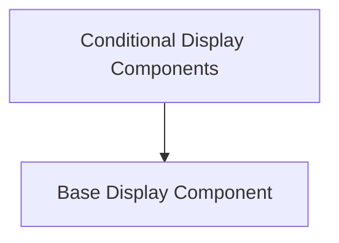

# Display Components Module Documentation

## Introduction

The `display_components` module provides a set of UI components designed to inform users about various application states, such as login requirements, outdated models, or upgrade prompts. It leverages a core `Display` component to ensure consistency in presentation across different types of messages.

## Architecture

The module is structured around a central `Display` component, which is then specialized by other components to handle specific use cases. This architecture promotes reusability and maintainability, allowing for consistent UI patterns while addressing diverse user notification needs.

<!-- DIAGRAM_JSON
{
    "direction": "TD",
    "nodes": [
        {"id": "base_display_component", "label": "Base Display Component", "type": "module", "link": "base_display_component.md"},
        {"id": "conditional_displays", "label": "Conditional Display Components", "type": "module", "link": "conditional_displays.md"}
    ],
    "edges": [
        {"source": "conditional_displays", "target": "base_display_component"}
    ],
    "groups": []
}
-->

## Sub-modules

### [Base Display Component](base_display_component.md)

This sub-module contains the core `Display` component, which serves as a generic container for displaying messages, actions, and dismissal options. It provides the foundational UI elements used by more specialized display components.

### [Conditional Display Components](conditional_displays.md)

This sub-module includes specialized display components such as `DisplayLogin`, `DisplayStale`, and `DisplayUpgrade`. These components extend the functionality of the `Base Display Component` to address specific application states, providing tailored messages and actions for scenarios like user authentication, model updates, or subscription limitations.