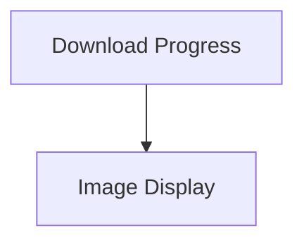

# Display Elements Module

## Introduction
The `display_elements` module provides a collection of UI components designed to enhance user interaction by visually representing various states and data, such as download progress and image previews.

## Architecture
The module is structured into two main sub-modules: `download_progress` for displaying download status and `image_display` for rendering image thumbnails.

<!-- DIAGRAM_JSON
{
    "direction": "TD",
    "nodes": [
        {"id": "download_progress", "label": "Download Progress", "type": "module", "link": "download_progress.md"},
        {"id": "image_display", "label": "Image Display", "type": "module", "link": "image_display.md"}
    ],
    "edges": [
        {"source": "download_progress", "target": "image_display", "label": "may interact with"}
    ],
    "groups": []
}
-->

## High-Level Functionality

### Download Progress ([download_progress.md](download_progress.md))
This sub-module contains components to visualize the progress of file downloads, showing completion percentage and formatted file sizes.

### Image Display ([image_display.md](image_display.md))
This sub-module provides components for robust image thumbnail rendering, supporting various image data formats and gracefully handling loading errors.
