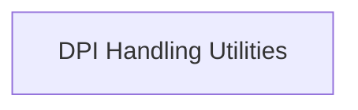

# DPI Management Module

## Introduction

The `dpi_management` module is a crucial component within the `app_webview_api.environment_management` module, specifically designed to handle High DPI (Dots Per Inch) settings for the application's webview. It ensures that the application renders correctly across various display scales, preventing common issues like blurry text or incorrectly sized UI elements on high-resolution screens.

## Architecture

This module primarily consists of a single sub-module, `dpi_handling_utilities`, which encapsulates the core functionality for enabling DPI awareness and querying window DPI information. It interacts with native Windows API functions to manage DPI settings, ensuring consistent display behavior.

<!-- DIAGRAM_JSON
{
    "direction": "TD",
    "nodes": [
        {"id": "dpi_handling_utilities", "label": "DPI Handling Utilities", "type": "module", "link": "dpi_handling_utilities.md"}
    ],
    "edges": [],
    "groups": []
}
-->

## Sub-modules

*   ### [DPI Handling Utilities](dpi_handling_utilities.md)
    Provides functions for enabling DPI awareness and retrieving the DPI of a window within the application's webview.
