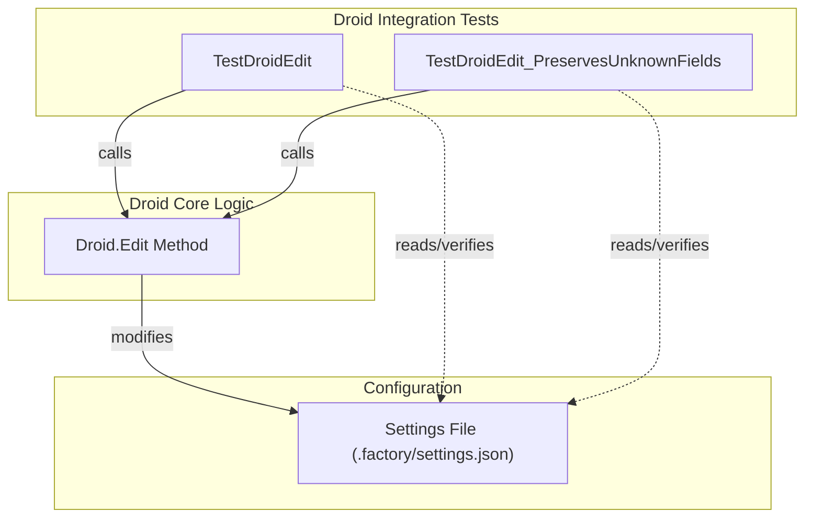

# droid_integration
This module contains tests for the `Droid.Edit` function, verifying its behavior in managing custom models within the application's settings and ensuring preservation of unknown fields.

<!-- DIAGRAM_JSON
{
    "nodes": [
        {
            "id": "TestDroidEdit",
            "label": "TestDroidEdit"
        },
        {
            "id": "TestDroidEdit_PreservesUnknownFields",
            "label": "TestDroidEdit_PreservesUnknownFields"
        },
        {
            "id": "DroidEdit",
            "label": "Droid.Edit Method"
        },
        {
            "id": "SettingsFile",
            "label": "Settings File (.factory/settings.json)"
        }
    ],
    "edges": [
        {
            "source": "TestDroidEdit",
            "target": "DroidEdit",
            "label": "calls"
        },
        {
            "source": "TestDroidEdit_PreservesUnknownFields",
            "target": "DroidEdit",
            "label": "calls"
        },
        {
            "source": "DroidEdit",
            "target": "SettingsFile",
            "label": "modifies"
        },
        {
            "source": "TestDroidEdit",
            "target": "SettingsFile",
            "label": "reads/verifies"
        },
        {
            "source": "TestDroidEdit_PreservesUnknownFields",
            "target": "SettingsFile",
            "label": "reads/verifies"
        }
    ],
    "groups": [
        {
            "id": "droid_integration_tests",
            "label": "Droid Integration Tests",
            "nodes": [
                "TestDroidEdit",
                "TestDroidEdit_PreservesUnknownFields"
            ]
        },
        {
            "id": "droid_core",
            "label": "Droid Core Logic",
            "nodes": [
                "DroidEdit"
            ]
        },
        {
            "id": "configuration",
            "label": "Configuration",
            "nodes": [
                "SettingsFile"
            ]
        }
    ]
}
-->
