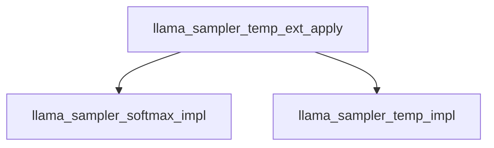

# Dynamic Temperature Sampling Module

## Introduction

The `dynamic_temperature_sampling` module implements an adaptive sampling strategy within the `llama.cpp` project. Its primary function is to dynamically adjust the sampling temperature based on the entropy of the predicted token probabilities. This allows for more nuanced control over the randomness of token generation, promoting more diverse outputs when the model is highly certain, and more focused outputs when the model is less certain.

## Purpose and Core Functionality

The core functionality of this module revolves around the `llama_sampler_temp_ext_apply` function. This function dynamically calculates a temperature value for token sampling by analyzing the entropy of the current token candidates. The calculated dynamic temperature is then used to rescale the logits before applying softmax, influencing the probability distribution of the next token.

The dynamic temperature is derived from a configurable base temperature (`ctx->temp`), a `delta` range, and an `exponent`. The normalized entropy of the current token probabilities is mapped to this temperature range using a power function, allowing for fine-grained control over the temperature's responsiveness to entropy changes.

### Core Components

*   **`llama.llama.cpp.src.llama-sampling.llama_sampler_temp_ext_apply`**: This is the central function that orchestrates the dynamic temperature calculation and application. It performs the following steps:
    1.  Determines a minimum and maximum temperature based on `ctx->temp` and `ctx->delta`.
    2.  Calculates the maximum possible entropy given the number of candidate tokens.
    3.  Applies an initial softmax to the token logits to get probabilities.
    4.  Calculates the actual entropy of these probabilities.
    5.  Normalizes the calculated entropy against the maximum possible entropy.
    6.  Maps the normalized entropy to a dynamic temperature within the `[min_temp, max_temp]` range using `ctx->exponent`.
    7.  Applies this `dyn_temp` to the token logits using `llama_sampler_temp_impl`.
    8.  Re-computes and re-normalizes softmax probabilities after the dynamic temperature scaling.

## Architecture and Component Relationships

This module is a leaf module within the `adaptive_sampling` submodule of `llama_cpp_sampling`. It relies on core sampling utility functions provided by the `llama_cpp_common.common_sampling.sampling_core_functions` module for basic softmax application and temperature scaling.

<!-- DIAGRAM_JSON
{
    "direction": "TD",
    "nodes": [
        {"id": "llama_sampler_temp_ext_apply", "label": "llama_sampler_temp_ext_apply", "type": "component", "link": null},
        {"id": "llama_sampler_softmax_impl", "label": "llama_sampler_softmax_impl", "type": "external", "link": "sampling_core_functions.md"},
        {"id": "llama_sampler_temp_impl", "label": "llama_sampler_temp_impl", "type": "external", "link": "sampling_core_functions.md"}
    ],
    "edges": [
        {"source": "llama_sampler_temp_ext_apply", "target": "llama_sampler_softmax_impl"},
        {"source": "llama_sampler_temp_ext_apply", "target": "llama_sampler_temp_impl"}
    ],
    "groups": []
}
-->

## How it Fits into the Overall System

The `dynamic_temperature_sampling` module is an integral part of the `llama_cpp_sampling` subsystem, specifically contributing to the `adaptive_sampling` techniques. It provides a sophisticated method for controlling the variability of generated text by dynamically adjusting the temperature parameter during the sampling process. This allows applications built on `llama.cpp` to generate outputs that are contextually relevant and diverse, without manually tweaking temperature settings for different scenarios. It enhances the model's ability to produce high-quality, human-like text by ensuring that the randomness of token selection is appropriately scaled based on the confidence of the model's predictions.