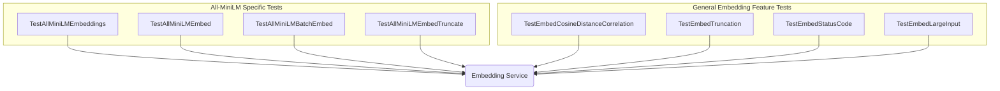

# embedding_service_tests
This module contains integration tests for the embedding service, covering various functionalities such as cosine distance correlation, specific model embeddings (all-minilm), batch processing, input truncation, error status codes, and handling large inputs.

<!-- DIAGRAM_JSON
{
  "nodes": [
    {"id": "A", "label": "TestEmbedCosineDistanceCorrelation"},
    {"id": "B", "label": "TestAllMiniLMEmbeddings"},
    {"id": "C", "label": "TestAllMiniLMEmbed"},
    {"id": "D", "label": "TestAllMiniLMBatchEmbed"},
    {"id": "E", "label": "TestEmbedTruncation"},
    {"id": "F", "label": "TestEmbedStatusCode"},
    {"id": "G", "label": "TestEmbedLargeInput"},
    {"id": "H", "label": "TestAllMiniLMEmbedTruncate"},
    {"id": "SERVICE", "label": "Embedding Service"}
  ],
  "edges": [
    {"source": "A", "target": "SERVICE"},
    {"source": "B", "target": "SERVICE"},
    {"source": "C", "target": "SERVICE"},
    {"source": "D", "target": "SERVICE"},
    {"source": "E", "target": "SERVICE"},
    {"source": "F", "target": "SERVICE"},
    {"source": "G", "target": "SERVICE"},
    {"source": "H", "target": "SERVICE"}
  ],
  "groups": [
    {
      "id": "all_minilm_tests",
      "label": "All-MiniLM Specific Tests",
      "nodes": ["B", "C", "D", "H"]
    },
    {
      "id": "general_embedding_tests",
      "label": "General Embedding Feature Tests",
      "nodes": ["A", "E", "F", "G"]
    }
  ]
}
-->
