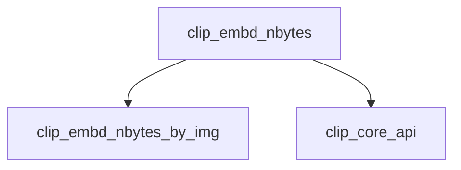

# Module: `embedding_utilities`

## Introduction
The `embedding_utilities` module provides essential utility functions specifically designed for managing and calculating the memory requirements of embeddings within the CLIP model integration in `llama.cpp`. Its primary role is to determine the byte size needed for image embeddings based on model parameters, facilitating efficient memory allocation and preventing buffer overflows.

## Architecture and Component Relationships

The `embedding_utilities` module is a leaf module that contains core functions for embedding-related calculations. It relies on context information provided by the `clip_core_api` module.

The main component is:
-   `clip_embd_nbytes`: Calculates the total byte size required for an image embedding given the CLIP context. It retrieves image dimensions from the context and delegates the actual size calculation to a helper function.

### Internal Components

The module's core functionality is encapsulated within the `clip_embd_nbytes` function, which leverages an internal helper:

-   `clip_embd_nbytes_by_img`: This is an internal helper function that performs the actual calculation of embedding bytes based on the provided image dimensions (`nx`, `ny`) and the CLIP context. This function is called by `clip_embd_nbytes`.

### External Dependencies

The `embedding_utilities` module depends on the `clip_core_api` module for crucial context information:

-   **`clip_core_api`**: Provides the `clip_ctx` structure, which contains essential model hyperparameters like `image_size`. This context is vital for calculating the correct embedding size. For more details, refer to the [clip_core_api documentation](clip_core_api.md).

## How it Fits into the Overall System
The `embedding_utilities` module is a fundamental part of the `clip_core_api` within the `llama_cpp_mtmd_clip` system. It ensures that memory for image embeddings can be precisely calculated, which is critical for the efficient operation of the CLIP model. By providing this utility, it supports the `clip_core_api` in managing resources and preparing data for the multi-modal processing capabilities of `llama.cpp`. Without accurate embedding size calculations, the CLIP model would face memory management issues, impacting performance and stability.

<!-- DIAGRAM_JSON
{
    "direction": "TD",
    "nodes": [
        {"id": "clip_embd_nbytes", "label": "clip_embd_nbytes", "type": "component", "link": null},
        {"id": "clip_embd_nbytes_by_img", "label": "clip_embd_nbytes_by_img", "type": "component", "link": null},
        {"id": "clip_core_api", "label": "clip_core_api", "type": "external", "link": "clip_core_api.md"}
    ],
    "edges": [
        {"source": "clip_embd_nbytes", "target": "clip_embd_nbytes_by_img"},
        {"source": "clip_embd_nbytes", "target": "clip_core_api"}
    ],
    "groups": []
}
-->
