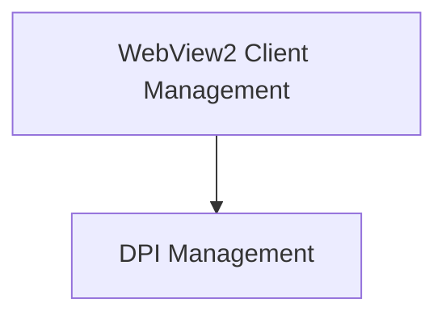

# Environment Management Module

## Introduction

The `environment_management` module is responsible for managing various aspects of the application's runtime environment, particularly focusing on display scaling (DPI awareness) and the interaction with the WebView2 browser client. It ensures that the application behaves correctly across different display configurations and seamlessly integrates with the embedded web browser component.

## Architecture Overview

The module is structured into two main sub-modules:
- **DPI Management**: Handles system-level display scaling and DPI settings.
- **WebView2 Client Management**: Manages the discovery, initialization, and core interactions with the WebView2 runtime.

<!-- DIAGRAM_JSON
{
    "direction": "TD",
    "nodes": [
        {"id": "dpi_management", "label": "DPI Management", "type": "module", "link": "dpi_management.md"},
        {"id": "webview_client_management", "label": "WebView2 Client Management", "type": "module", "link": "webview_client_management.md"}
    ],
    "edges": [
        {"source": "webview_client_management", "target": "dpi_management"}
    ],
    "groups": []
}
-->

## Sub-modules

### [DPI Management](dpi_management.md)
This sub-module focuses on ensuring the application correctly handles different DPI settings. It includes functionality to enable DPI awareness for the process and retrieve the DPI for specific windows, which is crucial for consistent UI rendering on high-resolution screens.

### [WebView2 Client Management](webview_client_management.md)
This sub-module is dedicated to managing the WebView2 runtime. It provides functionalities for finding available WebView2 clients, retrieving their version strings, and handling specific permissions requests, such as clipboard access, for the embedded web content.
