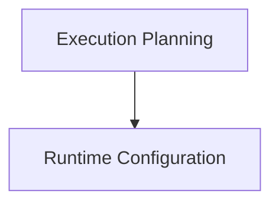

# Execution Management Module

## Introduction
The `execution_management` module is a core component within the `ggml_cpu_backend` that provides essential functionalities for managing the execution of computational graphs on the CPU. It handles the creation of execution plans, configuration of thread settings, and setup of abort mechanisms, ensuring efficient and controlled processing of tasks.

## Architecture Overview
The module is structured into two main sub-modules:
- **[Execution Planning](execution_planning.md)**: Responsible for generating optimized execution plans for computational graphs.
- **[Runtime Configuration](runtime_configuration.md)**: Manages the runtime environment of the CPU backend, including thread count, thread pools, and abort callbacks.

<!-- DIAGRAM_JSON
{
    "direction": "TD",
    "nodes": [
        {"id": "execution_planning", "label": "Execution Planning", "type": "module", "link": "execution_planning.md"},
        {"id": "runtime_configuration", "label": "Runtime Configuration", "type": "module", "link": "runtime_configuration.md"}
    ],
    "edges": [
        {"source": "execution_planning", "target": "runtime_configuration"}
    ],
    "groups": []
}
-->

## Sub-modules

### Execution Planning
This sub-module focuses on creating and managing `ggml` graph execution plans for the CPU backend. It leverages the `ggml_graph_plan` function to optimize task distribution and resource allocation, ensuring efficient computation.

### Runtime Configuration
The `runtime_configuration` sub-module provides interfaces to configure the operational parameters of the CPU backend. This includes setting the number of threads, assigning a thread pool for parallel execution, and defining an abort callback mechanism for graceful termination of operations.
