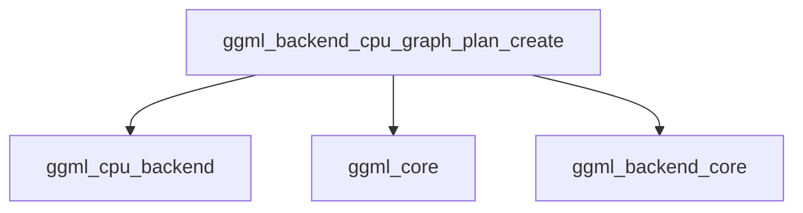

# execution_planning Module Documentation

The `execution_planning` module is a crucial component within the `ggml_cpu_backend`, responsible for transforming a generic computational graph into an optimized execution plan specifically tailored for CPU operations. This module ensures efficient utilization of CPU resources by preparing the graph for execution, including memory allocation and callback management.

## Core Functionality

The primary function of this module is `ggml_backend_cpu_graph_plan_create`. This function takes a GGML backend context and a computational graph as input, then generates a CPU-specific execution plan.

### `ggml_backend_cpu_graph_plan_create`

**Source:** `ml/backend/ggml/ggml/src/ggml-cpu/ggml-cpu.cpp`

```cpp
static ggml_backend_graph_plan_t ggml_backend_cpu_graph_plan_create(ggml_backend_t backend, const struct ggml_cgraph * cgraph) {
    struct ggml_backend_cpu_context * cpu_ctx = (struct ggml_backend_cpu_context *)backend->context;

    struct ggml_backend_plan_cpu * cpu_plan = new ggml_backend_plan_cpu;

    cpu_plan->cplan = ggml_graph_plan(cgraph, cpu_ctx->n_threads, cpu_ctx->threadpool);
    cpu_plan->cgraph = *cgraph; // FIXME: deep copy

    if (cpu_plan->cplan.work_size > 0) {
        cpu_plan->cplan.work_data = new uint8_t[cpu_plan->cplan.work_size];
        if (cpu_plan->cplan.work_data == NULL) {
            delete cpu_plan;
            return NULL;
        }
    }

    cpu_plan->cplan.abort_callback      = cpu_ctx->abort_callback;
    cpu_plan->cplan.abort_callback_data = cpu_ctx->abort_callback_data;

    return cpu_plan;
}
```

This function performs the following steps:
1.  **Context Retrieval**: It extracts the `ggml_backend_cpu_context` from the provided generic `ggml_backend_t`. This context contains CPU-specific configuration, such as the number of threads and the thread pool.
2.  **Plan Initialization**: A new `ggml_backend_plan_cpu` object is created to hold the CPU-specific execution plan.
3.  **Graph Planning**: It calls `ggml_graph_plan` (from the [ggml_core](ggml_core.md) module) to generate the core computational plan (`cplan`) based on the input `cgraph`, the number of threads, and the thread pool. This step is critical for determining the execution order and dependencies within the graph.
4.  **Work Buffer Allocation**: If the generated plan requires additional work memory (`cplan.work_size > 0`), it allocates a buffer (`work_data`) for intermediate computations.
5.  **Callback Assignment**: It sets the `abort_callback` and `abort_callback_data` from the CPU context, allowing for external control over the execution process.
6.  **Plan Return**: Finally, it returns the fully constructed `ggml_backend_plan_cpu` object, which is ready for execution on the CPU.

## Architecture and Component Relationships

The `execution_planning` module, specifically the `ggml_backend_cpu_graph_plan_create` function, interacts with several other key modules to fulfill its responsibilities.

<!-- DIAGRAM_JSON
{
    "direction": "TD",
    "nodes": [
        {"id": "ggml_backend_cpu_graph_plan_create", "label": "ggml_backend_cpu_graph_plan_create", "type": "component", "link": null},
        {"id": "ggml_cpu_backend", "label": "ggml_cpu_backend", "type": "external", "link": "ggml_cpu_backend.md"},
        {"id": "ggml_core", "label": "ggml_core", "type": "external", "link": "ggml_core.md"},
        {"id": "ggml_backend_core", "label": "ggml_backend_core", "type": "external", "link": "ggml_backend_core.md"}
    ],
    "edges": [
        {"source": "ggml_backend_cpu_graph_plan_create", "target": "ggml_cpu_backend"},
        {"source": "ggml_backend_cpu_graph_plan_create", "target": "ggml_core"},
        {"source": "ggml_backend_cpu_graph_plan_create", "target": "ggml_backend_core"}
    ],
    "groups": []
}
-->


-   **`ggml_backend_cpu_graph_plan_create`**: The core function within this module, responsible for orchestrating the creation of the CPU execution plan.
-   **[ggml_cpu_backend](ggml_cpu_backend.md)**: Provides the CPU-specific backend context (`ggml_backend_cpu_context`) which includes threading information and callbacks used during plan creation.
-   **[ggml_core](ggml_core.md)**: Supplies the fundamental graph structures (`ggml_cgraph`) and the generic `ggml_graph_plan` function, which is adapted by this module for CPU execution.
-   **[ggml_backend_core](ggml_backend_core.md)**: Defines the generic `ggml_backend_t` type, which is the input to the `ggml_backend_cpu_graph_plan_create` function, establishing the interface for backend-specific graph planning.

## System Integration

The `execution_planning` module is a vital part of the `ggml_cpu_backend`'s execution management subsystem. It serves as the bridge between a high-level computational graph definition and its low-level, optimized execution on the CPU. By generating a detailed execution plan, it prepares the graph for the subsequent execution phase, ensuring that all operations are performed efficiently and correctly with respect to CPU capabilities and available resources. This module is instantiated and utilized when a computational graph is submitted to the GGML CPU backend for processing.
