# external_integrations
The `external_integrations` module manages interactions with various external services and configuration files, primarily focusing on AI model providers like Ollama, OpenRouter, and Anthropic through components like Droid, Hermes, and Openclaw.

<!-- DIAGRAM_JSON
{
  "nodes": [
    {"id": "C_DR", "label": "Droid"},
    {"id": "C_HE", "label": "Hermes"},
    {"id": "C_OC", "label": "Openclaw"},
    {"id": "CF_SET", "label": "settings.json"},
    {"id": "CF_CFG", "label": "config.yaml"},
    {"id": "CF_OCJ", "label": "openclaw.json"},
    {"id": "ES_OLL", "label": "Ollama Service"},
    {"id": "ES_OPR", "label": "OpenRouter Service"},
    {"id": "ES_ANT", "label": "Anthropic Service"},
    {"id": "TU_HTS", "label": "HTTP Test Server"},
    {"id": "OU_CP", "label": "ConfirmPrompt"},
    {"id": "OU_EOI", "label": "ensureOpenclawInstalled"},
    {"id": "TU_STH", "label": "setTestHome"},
    {"id": "TU_WHP", "label": "withHermesPlatform"},
    {"id": "TU_WHO", "label": "withHermesOllamaURL"},
    {"id": "OU_WH", "label": "windowsHint"},
    {"id": "OU_PDS", "label": "patchDeviceScopes"},
    {"id": "OU_EWSP", "label": "ensureWebSearchPlugin"},
    {"id": "OU_RWSP", "label": "registerWebSearchPlugin"},
    {"id": "OU_RCSP", "label": "runChannelSetupPreflight"},
    {"id": "OU_EH", "label": "envconfig.Host"},
    {"id": "OU_EC", "label": "exec.Command"}
  ],
  "edges": [
    {"source": "C_DR", "target": "CF_SET", "label": "reads/writes"},
    {"source": "C_DR", "target": "ES_OLL", "label": "manages models"},
    {"source": "C_DR", "target": "TU_STH", "label": "uses (in tests)"},
    {"source": "C_HE", "target": "CF_CFG", "label": "reads/writes"},
    {"source": "C_HE", "target": "ES_OLL", "label": "configures provider"},
    {"source": "C_HE", "target": "ES_OPR", "label": "configures provider"},
    {"source": "C_HE", "target": "TU_HTS", "label": "uses (in tests)"},
    {"source": "C_HE", "target": "TU_STH", "label": "uses (in tests)"},
    {"source": "C_HE", "target": "TU_WHP", "label": "uses (in tests)"},
    {"source": "C_HE", "target": "TU_WHO", "label": "uses (in tests)"},
    {"source": "C_OC", "target": "CF_OCJ", "label": "reads/writes"},
    {"source": "C_OC", "target": "ES_OLL", "label": "onboards/configures"},
    {"source": "C_OC", "target": "ES_ANT", "label": "configures provider"},
    {"source": "C_OC", "target": "OU_CP", "label": "uses"},
    {"source": "C_OC", "target": "OU_EOI", "label": "uses"},
    {"source": "C_OC", "target": "TU_STH", "label": "uses (in tests)"},
    {"source": "C_OC", "target": "OU_WH", "label": "uses"},
    {"source": "C_OC", "target": "OU_PDS", "label": "uses"},
    {"source": "C_OC", "target": "OU_EWSP", "label": "uses"},
    {"source": "C_OC", "target": "OU_RWSP", "label": "uses"},
    {"source": "C_OC", "target": "OU_RCSP", "label": "uses"},
    {"source": "C_OC", "target": "OU_EH", "label": "uses"},
    {"source": "C_OC", "target": "OU_EC", "label": "uses"}
  ],
  "groups": [
    {"id": "G_EI", "label": "external_integrations", "members": ["C_DR", "C_HE", "C_OC"]},
    {"id": "G_OU", "label": "Openclaw Utilities", "members": ["OU_CP", "OU_EOI", "OU_WH", "OU_PDS", "OU_EWSP", "OU_RWSP", "OU_RCSP", "OU_EH", "OU_EC"]},
    {"id": "G_TU", "label": "Test Utilities", "members": ["TU_HTS", "TU_STH", "TU_WHP", "TU_WHO"]},
    {"id": "G_CF", "label": "Configuration Files", "members": ["CF_SET", "CF_CFG", "CF_OCJ"]},
    {"id": "G_ES", "label": "External Services", "members": ["ES_OLL", "ES_OPR", "ES_ANT"]}
  ]
}
-->

```mermaid
flowchart TD
    subgraph G_EI [external_integrations]
        C_DR[Droid]
        C_HE[Hermes]
        C_OC[Openclaw]
    end

    subgraph G_OU [Openclaw Utilities]
        OU_CP(ConfirmPrompt)
        OU_EOI(ensureOpenclawInstalled)
        OU_WH(windowsHint)
        OU_PDS(patchDeviceScopes)
        OU_EWSP(ensureWebSearchPlugin)
        OU_RWSP(registerWebSearchPlugin)
        OU_RCSP(runChannelSetupPreflight)
        OU_EH(envconfig.Host)
        OU_EC(exec.Command)
    end

    subgraph G_TU [Test Utilities]
        TU_HTS(HTTP Test Server)
        TU_STH(setTestHome)
        TU_WHP(withHermesPlatform)
        TU_WHO(withHermesOllamaURL)
    end

    subgraph G_CF [Configuration Files]
        CF_SET(settings.json)
        CF_CFG(config.yaml)
        CF_OCJ(openclaw.json)
    end

    subgraph G_ES [External Services]
        ES_OLL(Ollama Service)
        ES_OPR(OpenRouter Service)
        ES_ANT(Anthropic Service)
    end

    C_DR -- "reads/writes" --> CF_SET
    C_DR -- "manages models" --> ES_OLL
    C_DR -- "uses (in tests)" --> TU_STH

    C_HE -- "reads/writes" --> CF_CFG
    C_HE -- "configures provider" --> ES_OLL
    C_HE -- "configures provider" --> ES_OPR
    C_HE -- "uses (in tests)" --> TU_HTS
    C_HE -- "uses (in tests)" --> TU_STH
    C_HE -- "uses (in tests)" --> TU_WHP
    C_HE -- "uses (in tests)" --> TU_WHO

    C_OC -- "reads/writes" --> CF_OCJ
    C_OC -- "onboards/configures" --> ES_OLL
    C_OC -- "configures provider" --> ES_ANT
    C_OC -- "uses" --> OU_CP
    C_OC -- "uses" --> OU_EOI
    C_OC -- "uses (in tests)" --> TU_STH
    C_OC -- "uses" --> OU_WH
    C_OC -- "uses" --> OU_PDS
    C_OC -- "uses" --> OU_EWSP
    C_OC -- "uses" --> OU_RWSP
    C_OC -- "uses" --> OU_RCSP
    C_OC -- "uses" --> OU_EH
    C_OC -- "uses" --> OU_EC
```
