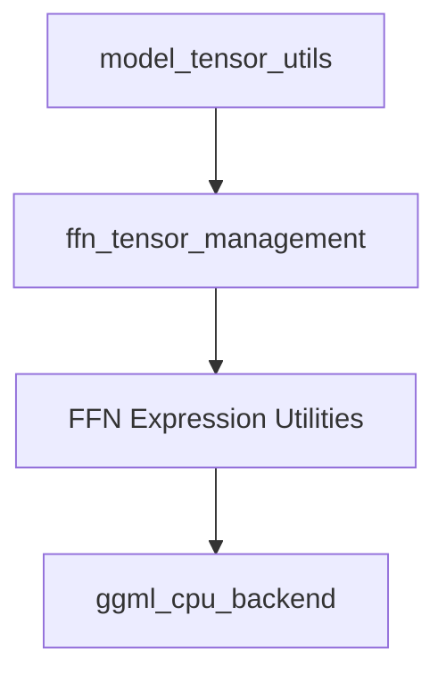

# `ffn_tensor_management` Module Documentation

## Introduction
This module is responsible for managing Feed Forward Network (FFN) tensor expressions within the `llama.cpp` common utilities. It provides specialized functions for generating regular expressions to identify FFN blocks and for overriding CPU buffer types for these tensors. It is a critical component for optimizing FFN operations by allowing targeted management and potential CPU overrides for specific tensor blocks.

## Architecture Overview
The `ffn_tensor_management` module is a specialized sub-module residing within `model_tensor_utils`, which itself is part of the broader `llama_cpp_common` library. Its primary function is to abstract the complexities of FFN tensor identification and provide mechanisms for backend-specific optimizations, such as CPU buffer overrides. It interacts with the `ggml_cpu_backend` to apply these overrides, ensuring efficient tensor handling.

<!-- DIAGRAM_JSON
{
    "direction": "TD",
    "nodes": [
        {"id": "model_tensor_utils", "label": "Model Tensor Utilities", "type": "external", "link": "model_tensor_utils.md"},
        {"id": "ffn_tensor_management", "label": "FFN Tensor Management", "type": "module"},
        {"id": "ffn_expression_utilities", "label": "FFN Expression Utilities", "type": "module", "link": "ffn_expression_utilities.md"},
        {"id": "ggml_cpu_backend", "label": "GGML CPU Backend", "type": "external", "link": "ggml_cpu_backend.md"}
    ],
    "edges": [
        {"source": "model_tensor_utils", "target": "ffn_tensor_management"},
        {"source": "ffn_tensor_management", "target": "ffn_expression_utilities"},
        {"source": "ffn_expression_utilities", "target": "ggml_cpu_backend"}
    ],
    "groups": []
}
-->

## Sub-modules

### [FFN Expression Utilities](ffn_expression_utilities.md)
Provides utilities for handling Feed Forward Network (FFN) tensor expressions, including regular expression generation and CPU buffer overrides.
