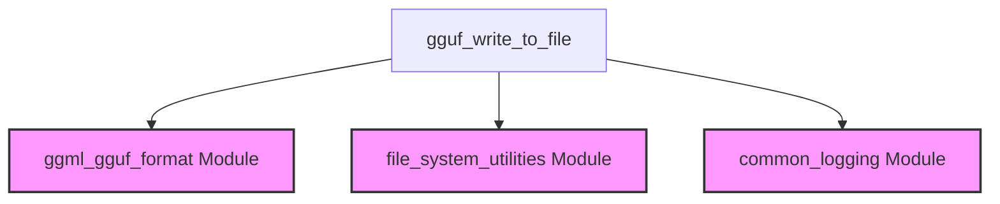

The `file_io` module, situated within the `ggml_gguf_format` module, is responsible for handling the persistent storage of GGUF (GGML Universal File Format) data. Its primary function is to serialize GGUF contexts, including their metadata and associated tensor data, into binary files.

### Purpose and Core Functionality

The `file_io` module provides the essential mechanism for writing GGUF data to disk, enabling the saving and loading of models and their configurations. This is critical for model persistence, allowing models to be stored after training or processing and later reloaded for inference or further operations without needing to reconstruct them in memory. The module supports writing both complete GGUF data (metadata and tensors) and metadata-only representations, offering flexibility for various use cases.

### Architecture and Component Relationships

The `file_io` module contains a single core component, `gguf_write_to_file`, which orchestrates the file writing process. This component interacts with other internal parts of the `ggml_gguf_format` module, such as `gguf_context`, `gguf_writer_file`, and `gguf_write_out`, to manage the data structure and the actual serialization logic.

It also depends on external utility modules for low-level file operations and logging. Specifically, it uses `ggml_fopen` from the `file_system_utilities` module for safe file handling and `GGML_LOG_ERROR` from `common_logging` for error reporting.

The interaction flow involves:
1. Opening a file using a utility function.
2. Initializing a GGUF writer.
3. Performing the write operation, potentially handling exceptions.
4. Closing the file.

### How the Module Fits into the Overall System

The `file_io` module is a foundational component of the `ggml_gguf_format` module, which itself is part of the `ggml_core` framework. It plays a crucial role in the GGML ecosystem by providing the means to store and retrieve model data in the GGUF format. This capability is essential for any application that needs to manage and deploy machine learning models built with GGML, ensuring that models can be efficiently saved and loaded across different sessions or systems.

<!-- DIAGRAM_JSON
{
    "direction": "TD",
    "nodes": [
        {"id": "gguf_write_to_file", "label": "gguf_write_to_file", "type": "component", "link": null},
        {"id": "gguf_gguf_format_module", "label": "ggml_gguf_format Module", "type": "external", "link": "ggml_gguf_format.md"},
        {"id": "file_system_utilities", "label": "file_system_utilities Module", "type": "external", "link": "file_system_utilities.md"},
        {"id": "common_logging", "label": "common_logging Module", "type": "external", "link": "common_logging.md"}
    ],
    "edges": [
        {"source": "gguf_write_to_file", "target": "gguf_gguf_format_module"},
        {"source": "gguf_write_to_file", "target": "file_system_utilities"},
        {"source": "gguf_write_to_file", "target": "common_logging"}
    ],
    "groups": []
}
-->
