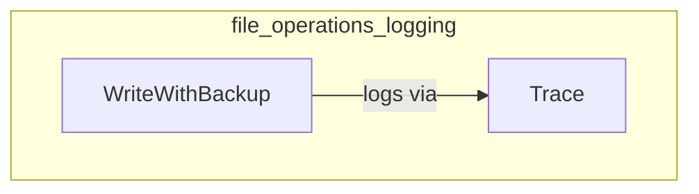

# file_operations_logging
This module provides robust file operation capabilities, including backup mechanisms, and integrates a tracing utility for logging operational details.

<!-- DIAGRAM_JSON
{
  "nodes": [
    {"id": "A", "label": "WriteWithBackup"},
    {"id": "B", "label": "Trace"}
  ],
  "edges": [
    {"source": "A", "target": "B", "label": "logs via"}
  ],
  "groups": [
    {"id": "file_operations_logging", "label": "file_operations_logging", "nodes": ["A", "B"]}
  ]
}
-->
