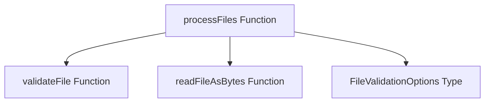

# Module: `file_processing`

## Introduction
The `file_processing` module, a sub-module of `app_ui_utils`, provides core functionality for handling file uploads and processing within the application's user interface. Its primary role is to validate incoming files, read their content, and categorize them into valid files or errors, ensuring that only appropriate files are further processed by the system.

## Architecture and Component Relationships

The `file_processing` module primarily consists of the `processFiles` function, which orchestrates the validation and reading of multiple files. It relies on external utility functions for individual file validation and byte-level content reading.

<!-- DIAGRAM_JSON
{
    "direction": "TD",
    "nodes": [
        {"id": "process_files", "label": "processFiles Function", "type": "component", "link": null},
        {"id": "validate_file", "label": "validateFile Function", "type": "external", "link": "app_ui_utils.md"},
        {"id": "read_file_as_bytes", "label": "readFileAsBytes Function", "type": "external", "link": "app_ui_utils.md"},
        {"id": "file_validation_options", "label": "FileValidationOptions Type", "type": "external", "link": "app_ui_types.md"}
    ],
    "edges": [
        {"source": "process_files", "target": "validate_file"},
        {"source": "process_files", "target": "read_file_as_bytes"},
        {"source": "process_files", "target": "file_validation_options"}
    ],
    "groups": []
}
-->

### Components

#### `processFiles` Function
(Source: `app/ui/app/src/utils/fileValidation.ts`)

The `processFiles` function is an asynchronous utility that takes an array of `File` objects and an optional `FileValidationOptions` object. It iterates through each file, performing the following steps:
1.  **Validation**: Calls an external `validateFile` function to check if the file meets the specified criteria (e.g., size, type).
2.  **Error Handling**: If validation fails, an error is recorded for the file, and processing continues to the next file.
3.  **Content Reading**: If the file is valid, it attempts to read the file's content as a `Uint8Array` using the `readFileAsBytes` utility.
4.  **Result Aggregation**: Collects successfully processed files along with their names, binary data, and types into `validFiles`. Any files that cause errors during validation or reading are added to the `errors` array.

This function ensures that subsequent application logic receives a clean, validated, and readily usable collection of file data.

### Dependencies

*   **`app_ui_utils`**: This module depends on utility functions defined within the broader `app_ui_utils` module, specifically `validateFile` for file content and metadata checks, and `readFileAsBytes` for converting `File` objects into `Uint8Array`. For more details, refer to the [app_ui_utils documentation](app_ui_utils.md).
*   **`app_ui_types`**: The `FileValidationOptions` type, used to configure the validation process, is defined in the `app_ui_types` module. For more details on available options, refer to the [app_ui_types documentation](app_ui_types.md).

## How the Module Fits into the Overall System

The `file_processing` module serves as a crucial frontend utility within the `app_ui_utils` ecosystem. It acts as an initial gatekeeper for any user-provided files, performing necessary validation and conversion before these files are passed to other UI components or API clients for further action (e.g., uploading to a server, local processing). This ensures data integrity and a robust user experience by catching potential issues early in the file handling pipeline. It is directly used by parts of the UI that require file input, such as upload forms or drag-and-drop interfaces.