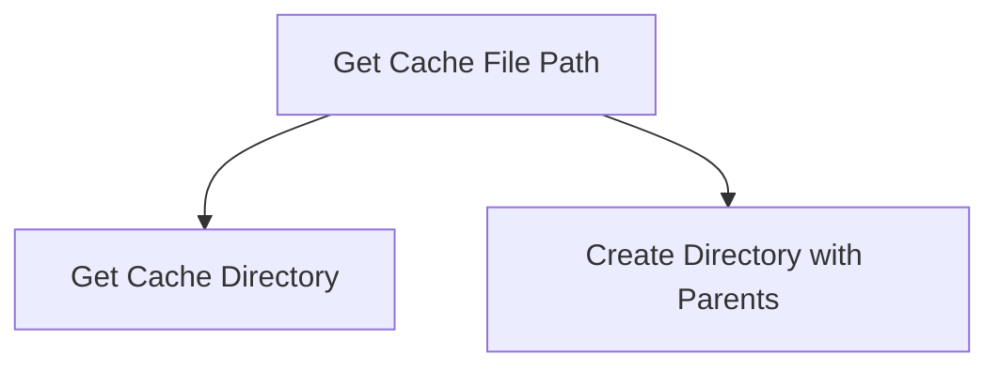

# file_system_utilities

## Introduction

The `file_system_utilities` module, a sub-module of `system_utilities` within `llama_cpp_common.common_utils`, provides essential functionalities for managing file system operations, particularly concerning cache file handling. Its primary role is to abstract away the complexities of path construction and directory management for application-specific cache files, ensuring a consistent and robust approach to file storage.

## Core Functionality

This module focuses on providing utilities to interact with the file system for caching purposes. The main component exposed by this module is `fs_get_cache_file`, which is responsible for determining the full path to a cache file and ensuring that its parent directories exist.

### `fs_get_cache_file`

```cpp
std::string fs_get_cache_file(const std::string & filename) {
    GGML_ASSERT(filename.find(DIRECTORY_SEPARATOR) == std::string::npos);
    std::string cache_directory = fs_get_cache_directory();
    const bool success = fs_create_directory_with_parents(cache_directory);
    if (!success) {
        throw std::runtime_error("failed to create cache directory: " + cache_directory);
    }
    return cache_directory + filename;
}
```

This function takes a `filename` as input and returns the complete, absolute path to where the cache file should be stored. It performs the following key operations:

1.  **Input Validation**: Asserts that the provided `filename` does not contain any directory separators, enforcing a flat structure for filenames within the cache directory.
2.  **Cache Directory Retrieval**: Calls `fs_get_cache_directory()` to obtain the base path for the application's cache storage.
3.  **Directory Creation**: Utilizes `fs_create_directory_with_parents()` to ensure that the entire directory path leading to the cache file exists. If the directories do not exist, they are created recursively.
4.  **Error Handling**: If the creation of the cache directory fails for any reason, a `std::runtime_error` is thrown, indicating the failure.
5.  **Path Construction**: Concatenates the cache directory path with the provided `filename` to form the final, full path to the cache file.

## Architecture and Component Relationships

The `file_system_utilities` module is designed to be a self-contained unit for cache file path resolution and directory management. It relies on internal helper functions, `fs_get_cache_directory` and `fs_create_directory_with_parents`, which are part of the broader system utilities to perform their respective tasks.

<!-- DIAGRAM_JSON
{
    "direction": "TD",
    "nodes": [
        {"id": "fs_get_cache_file", "label": "Get Cache File Path", "type": "component", "link": null},
        {"id": "fs_get_cache_directory", "label": "Get Cache Directory", "type": "component", "link": null},
        {"id": "fs_create_directory_with_parents", "label": "Create Directory with Parents", "type": "component", "link": null}
    ],
    "edges": [
        {"source": "fs_get_cache_file", "target": "fs_get_cache_directory"},
        {"source": "fs_get_cache_file", "target": "fs_create_directory_with_parents"}
    ],
    "groups": []
}
-->



## Module Relationships and System Integration

This module is a leaf module within the `system_utilities` module, which itself is part of `common_utils` under `llama_cpp_common`. It provides specific file system abstraction for cache management, making it a foundational component for any part of the `llama.cpp` project that needs to store and retrieve data from a designated cache location. Its integration simplifies cache handling across the application by centralizing the logic for cache file path generation and directory setup.

For more general system-wide utility functions, refer to the [system_utilities.md](system_utilities.md) documentation. For broader common utilities, see [common_utils.md](common_utils.md).